```{r setup, include=FALSE}
knitr::opts_chunk$set(
  echo = TRUE,
  fig.align = "center",
  out.width = "90%")
```


# Declaration

In submitting this work I am indicating that I have read the University's Academic Integrity Policy. I declare that all material in this assessment is my own work except where there is clear acknowledgement and reference to the work of others. I give permission for this work to be reproduced and submitted to other academic staff for educational purposes.


# Abstract
This report examines whether the predictors of self-reported COVID-19 protective behaviour changed after the onset of sustained face-mask mandates and whether these patterns were shared across countries. Repeated cross-sectional YouGov survey data were linked to subnational policy records from the Oxford COVID-19 Government Response Tracker for Australia, Brazil, Canada, India, the United Kingdom and the United States. Two binary outcomes were analysed: frequent or consistent face-mask wearing and overall protective behaviour. Separate before- and after-mandate models were fitted for each country and outcome using Random Forest and XGBoost, producing 24 modelling tasks. Predictive performance was evaluated using held-out ROC AUC, and model-based feature importance was used to compare the leading predictors.

XGBoost achieved the higher test AUC in 19 of the 24 tasks, although its average performance was only slightly higher than Random Forest. Face-mask wearing was most consistently predicted by engagement in other protective behaviours, whereas overall protective behaviour was most consistently predicted by willingness to self-isolate. Risk perception, symptom-related isolation, physical contact, survey timing, employment and confidence-related variables also contributed. Predictor importance changed between policy periods in every country, but the direction and structure of these changes differed. The results indicate a shared behavioural core alongside country- and period-specific predictive patterns.


# Introduction
Protective behaviours such as face-mask wearing, physical distancing, hand hygiene and self-isolation were central to reducing infection risk during the COVID-19 pandemic [@lisi2021, pp. 1--2]. Understanding why individuals adopted these behaviours is important because public-health measures depend not only on the existence of policy, but also on how people respond within different social and institutional settings. Previous research has associated protective behaviour with demographic characteristics, perceived risk, trust, psychological factors and national context [@galasso2020, pp. 27285--27287; @roma2020, pp. 2--6; @vanlissa2022, pp. 2--8; @taye2023, pp. 11--12]. These relationships may also change over time as policies, public information, infection levels and social expectations develop.

Mask mandates provide a useful policy boundary for examining whether the predictive structure of protective behaviour changes. Earlier research in Australia found that the leading predictors of mask wearing and broader protective behaviour differed before and after mandate onset [@ryan2025, pp. 2--4, 8--11]. However, countries differ in survey timing, population characteristics, institutions and policy histories. A cross-national comparison using a common analytical procedure can therefore distinguish recurring predictive patterns from those that depend more strongly on national context.

This report analyses repeated cross-sectional survey responses from the Imperial College London/YouGov COVID-19 Behaviour Tracker and links them to face-covering policy records from the Oxford COVID-19 Government Response Tracker [@yougovdata; @oxcgrtdata]. Six countries are examined: Australia, Brazil, Canada, India, the United Kingdom and the United States. In this report, compliance refers to frequent or consistent self-reported performance of a protective behaviour; it does not represent direct observation of legal compliance. Two outcomes are considered: face-mask wearing and overall protective behaviour. Their definitions are held constant across countries. Each national model contains a shared core of predictors together with additional variables retained from the corresponding country data.

Separate models are constructed for the periods before and after sustained mask-mandate onset. Random Forest and XGBoost are used to predict each outcome, and feature importance is examined to identify the variables that contribute most strongly within each country, period and task. The purpose is not to estimate the causal effect of mandates. Instead, mandate timing is used to divide the observations into comparable policy periods and assess whether predictive relationships were reorganised after that boundary.

The analysis addresses three research questions:

1. Within each country, do the key predictors of compliance with COVID-19 protective behaviours change before and after mask mandates?
2. Are these changes consistent across countries, or do they vary?
3. Is there a set of common cross-national predictors alongside country-specific predictors?

By answering these questions, the report evaluates whether protective behaviour can be understood through a common predictive structure or whether its leading predictors depend primarily on country and policy period. The comparison is intended to identify both recurring behavioural and attitudinal factors and the national differences that may be obscured by a single pooled analysis.


# Background

Protective behaviours were a central part of the public-health response to COVID-19 [@lisi2021,pp. 1--2]. This report analyses self-reported behaviours from repeated survey waves and links each response to the policy context at the survey date. The main terms used throughout the report are defined in Table \ref{tab:background-definitions}.

\begin{table}[H]
\centering
\small
\begin{tabular}{p{0.28\linewidth}p{0.62\linewidth}}
\toprule
Term & Meaning in this report \\
\midrule
Protective behaviour & Self-reported actions intended to reduce infection risk, such as mask wearing, physical distancing, hand hygiene, reducing close contacts and self-isolation. \\
Compliance & Frequent or consistent self-reported performance of a protective behaviour. It is not direct observation of legal compliance. \\
Policy period & Whether a survey response was observed before or after sustained mask-mandate onset. \\
Mask mandate & A policy context identified from the OxCGRT face-covering indicator, rather than a direct measure of enforcement or individual behaviour. \\
Feature importance & A model-based measure of predictive contribution within a specific country, policy period, outcome and model. It is not interpreted as a causal effect. \\
\bottomrule
\end{tabular}
\caption{Key terms used in this report.}
\label{tab:background-definitions}
\end{table}

Studies of COVID-19 protective behaviour have identified demographic, psychological and social predictors. Pandemic attitudes and reported behaviour differed by gender and national setting [@galasso2020, pp. 27285--27287; @haischer2020, pp. 1--2]. Perceived risk, trust and psychological characteristics were also associated with compliance [@roma2020, pp. 2--6; @taye2023, pp.11--12], while the relative importance of predictors varied across countries [@vanlissa2022, pp. 2--8; @taye2023]. These findings support the inclusion of demographic, health, attitudinal and behavioural variables alongside the policy-period indicator.

Mask mandates provide a policy boundary for examining whether predictive relationships changed over time. An Australian study reported different leading predictors of mask wearing and broader protective behaviour before and after mandate onset [@ryan2025, pp. 2--4, 8--11]. Separate models were therefore fitted for the two policy periods.

Cross-national comparison requires a common analytical procedure because countries differ in demographic composition, survey timing and policy history. The same outcome definitions, preprocessing rules and modelling procedure were therefore applied to every retained country.

The individual-level data came from the Imperial College London/YouGov COVID-19 Behaviour Tracker Data Hub [@yougovdata]. The anonymised survey files contain protective behaviours, demographic and household characteristics, employment, health conditions, symptoms, mental-health items, confidence in institutions, perceived risk and attitudes toward public-health measures. The data is a repeated cross-section: each row is a response for a specific date and location, and the same person will not be tracked in multiple rounds of investigation.

Policy timing came from the Oxford COVID-19 Government Response Tracker (OxCGRT) [@oxcgrtdata]. The variable \(\texttt{H6M\_Facial Coverings}\) records face-covering policy strength by date, with subnational records identified through \(\texttt{RegionName}\) and \(\texttt{RegionCode}\) where available. Figure \ref{fig:background-linkage} summarises the linkage between survey responses and policy records.

\begin{figure}[H]
\centering
\includegraphics[width=1\linewidth]{1.png}
\caption{Linking survey responses to policy-period information.}
\label{fig:background-linkage}
\end{figure}

The initial audit covered Australia, Brazil, Canada, China, India, the United Kingdom and the United States. China was not retained because its survey file lacked several columns required by the common workflow. The modelling analysis used the remaining six countries.

Random Forest and XGBoost were selected because both can represent nonlinear relationships and interactions. Random Forest aggregates predictions from many decision trees [@breiman2001rf, pp. 5--8]. XGBoost builds regularised trees sequentially, with later trees correcting errors in the current ensemble [@chen2016xgboost, pp. 785--788]. And both models have performed well in relevant studies in Australia [@ryan2025, pp. 9].

ROC AUC was used to measure how well each model separated compliant from non-compliant responses across possible classification thresholds [@fawcett2006, pp. 868]. Let \(\hat{p}_i^{+}\) denote the predicted probability for a positive-class observation and \(\hat{p}_j^{-}\) the predicted probability for a negative-class observation. ROC AUC can be interpreted as
\begin{align}
\mathrm{AUC} = \Pr \left( \hat{p}_i^{+} > \hat{p}_j^{-} \right),
\end{align}
Higher AUC values indicate stronger discrimination between compliant and non-compliant responses.


The analysis compares predictors of face-mask wearing and overall protective behaviour before and after sustained mandate onset in six countries. It focuses on predictors that recur across countries and those that vary by policy period or national setting.

\newpage


# Methods

The analysis comprised data preparation, outcome construction, policy-period assignment, feature encoding, model fitting and evaluation. All the code and data for implementing these features can be found on my GitHub [@zhao2026github]. Table \ref{tab:method-code-map} links each stage to its implementation file.

\begin{table}[H]
\centering
\small
\begin{tabular}{p{0.42\linewidth}p{0.44\linewidth}}
\toprule
Method stage & Implementation file \\
\midrule
Column audit, file reading, country inclusion and initial renaming & \texttt{001 Uniform column format.ipynb} \\
Subnational region-name harmonisation & \texttt{001\_2 State mapping.ipynb} \\
Missing-data screening, response recoding, outcome construction and mandate-period assignment & \texttt{002 Data Clean.ipynb} \\
Readable names for encoded variables & \texttt{003 Column Names update.ipynb} \\
Country-period-outcome train/test split & \texttt{004 Split.ipynb} \\
Random Forest fitting, tuning, AUC extraction and feature-importance extraction & \texttt{005 Random Forest (Model).ipynb} \\
XGBoost fitting, tuning, AUC extraction and feature-importance extraction & \texttt{006 XGBoost (Model).ipynb} \\
\bottomrule
\end{tabular}
\caption{Code files implementing the analysis workflow.}
\label{tab:method-code-map}
\end{table}


## Data preparation workflow

The raw data files were first read using a common file-audit procedure. Four encodings were tried in order: \(\texttt{utf-8-sig}\), \(\texttt{utf-8}\), \(\texttt{cp1252}\) and \(\texttt{latin1}\). A sample of 5,000 rows was used during the audit to check file readability and column availability. Missing-value strings were standardised during reading, with blank strings, single-space values and \(\texttt{\_\_NA\_\_}\) treated as missing. (\texttt{001 Uniform column format.ipynb, Cell 3)}

The first preprocessing step standardised the column names required for the common workflow. In the Brazil OxCGRT file, \(\texttt{H6\_Facial Coverings}\) was renamed to \(\texttt{H6M\_Facial Coverings}\). In the YouGov files for Brazil, Canada and the United Kingdom, \(\texttt{region}\) was renamed to \(\texttt{state}\). China was excluded before modelling because the available YouGov file did not contain several required columns, including variables needed for employment and policy-attitude predictors. (\texttt{001 Uniform column format.ipynb, Cells 5--6)}

Subnational names were then harmonised so that YouGov survey locations could be matched to OxCGRT regions. This step corrected bilingual or alternative region names in Canada, mapped English regions in the United Kingdom to the corresponding OxCGRT region, standardised selected Indian territory names, and mapped District of Columbia to Washington DC for the United States. Accents were removed from region names after mapping. The Ladakh region was removed from the India OxCGRT file because it could not be matched to the YouGov region structure used in the analysis. A final check was applied to verify that all YouGov regions used for modelling had corresponding OxCGRT region names. (\texttt{001\_2 State mapping.ipynb, Cells 3--5)}

For each retained country, columns with more than 30\% missing values in the YouGov data were removed before modelling. The variables \(\texttt{cantril\_ladder}\), \(\texttt{qweek}\), \(\texttt{weight}\) and \(\texttt{household\_children}\) were also excluded because they were not required for the prediction tasks and introduced additional missingness or non-comparable information. (\texttt{002 Data Clean.ipynb, Cell 9)}


## Variable recoding and outcome construction

Variables with numerical meaning were recoded before row filtering. Household size was converted to a numeric count, with values 1 to 7 retained as their integer values, `8 or more` coded as 8, and non-informative answers such as `Prefer not to say`, `Prefer not to answer`, `Don't know`, and `N/A` treated as missing. Agreement-scale variables, including perceived COVID-19 severity and infection risk, were converted to ordered numerical scores from 1 to 7. Protective-behaviour frequency items were converted using Table \ref{tab:frequency-recoding}. A value of 4 or 5 was treated as compliant because these responses correspond to frequent or consistent performance of the behaviour. (\texttt{002 Data Clean.ipynb, Cell 5)}


\begin{table}[H]
\centering
\small
\begin{tabular}{ll}
\toprule
Original response & Recoded value \\
\midrule
Not at all & 1 \\
Rarely & 2 \\
Sometimes & 3 \\
Frequently & 4 \\
Always & 5 \\
\bottomrule
\end{tabular}
\caption{Recoding of protective-behaviour frequency}
\label{tab:frequency-recoding}
\end{table}

Two binary outcomes were constructed: face-mask wearing compliance and overall protective behaviour compliance. The first uses the common mask-wearing item, while the second summarises the retained protective-behaviour items. Table \ref{tab:outcome-definitions} gives the outcome definitions. (\texttt{002 Data Clean.ipynb, Cell 10)}

\begin{table}[H]
\centering
\small
\begin{tabular}{p{0.32\linewidth}p{0.52\linewidth}}
\toprule
Outcome variable & Interpretation \\
\midrule
Face Mask Wearing & Whether the respondent reported frequent or consistent mask wearing in the common mask-wearing survey item \\
Overall Protective Behaviour & Whether the respondent generally reported frequent or consistent engagement across the retained set of protective behaviours, such as distancing, hygiene-related behaviour, avoidance of risky settings, and related self-protective actions \\
\bottomrule
\end{tabular}
\caption{Definitions of the two binary outcome variables.}
\label{tab:outcome-definitions}
\end{table}

Let \(s_{ij}\) denote the recoded frequency score for respondent \(i\) on protective-behaviour item \(j\). Let \(C\) denote the set of common protective-behaviour items retained across the six analysed countries, and let \(m\) denote the common face-mask item \(\texttt{i12\_health\_1}\). The face-mask wearing score and binary outcome were defined as
\begin{align}
S_i^{\mathrm{mask}} &= s_{im}, \\
Y_i^{\mathrm{mask}} &= \mathbb{I}\left(S_i^{\mathrm{mask}} \geq 4\right),
\end{align}
where \(Y_i^{\mathrm{mask}}=1\) indicates frequent or consistent self-reported mask wearing and \(Y_i^{\mathrm{mask}}=0\) otherwise.

The overall protective behaviour score was calculated as the median of the common protective-behaviour items:
\begin{align}
S_i^{\mathrm{overall}} &= \operatorname{median}\{s_{ij}: j \in C\}, \\
Y_i^{\mathrm{overall}} &= \mathbb{I}\left(S_i^{\mathrm{overall}} \geq 4\right).
\end{align}
The median summarised the respondent's typical frequency across all common protective-behaviour items, with complete responses required for the score to be calculated. A non-mask protective behaviour score was also calculated as the median over \(C \setminus \{m\}\). This derived score was retained only as a predictor for the face-mask task and was removed from the overall protective behaviour task to avoid target leakage. (\texttt{002 Data Clean.ipynb, Cell 7)}


After the outcome variables had been created, rows with missing values in numeric or date variables were removed. Remaining missing values in categorical variables were retained as an explicit `N/A` category. This retained responses with missing categorical values. The original comorbidity indicators `d1_health_*` were collapsed into a single comorbidity variable. Respondents were classified as reporting comorbidity if any disease-specific comorbidity item was marked `Yes`. The values `No`, `Prefer not to say` and `N/A` were retained as distinct categories before dummy encoding. A relative survey-time variable was then created by grouping each respondent's survey completion date into 14-day intervals starting from the first retained date in that country. (\texttt{002 Data Clean.ipynb, Cells 4,8,11)}


## Policy-period construction
         
The policy-period variable was derived from the OxCGRT \(\texttt{H6M\_Facial Coverings}\) indicator. Policy dates were converted from \(\texttt{YYYYMMDD}\) format into calendar dates, and the face-covering indicator was converted to a numeric value. For each subnational region with OxCGRT region records, a 14-day rolling mean of the face-covering indicator was calculated:
\begin{align}
\bar{H}_{r,t}^{(14)} = \frac{1}{14}\sum_{k=0}^{13} H_{r,t-k},
\end{align}
where \(H_{r,t}\) is the face-covering indicator for region \(r\) on day \(t\). Rolling means were calculated only when all 14 daily values were available. (\texttt{002 Data Clean.ipynb, Cells 3,6)}

The mandate start date for a region was defined using the threshold
\begin{align}
\bar{H}_{r,t}^{(14)} \geq 2.5.
\end{align}
Where this threshold was reached, the first threshold-crossing date was used as the mandate start date. Where the threshold was not reached, the first date on which the region reached its maximum 14-day rolling mean was used. The threshold and maximum-rolling-average rule is illustrated in Appendix A. (\texttt{002 Data Clean.ipynb, Cell 6)}

Each survey response was then assigned a binary mandate-period indicator:
\begin{align}
P_i =
\begin{cases}
0, & \text{if the survey date was before the assigned mandate start date},\\
1, & \text{if the survey date was on or after the assigned mandate start date}.
\end{cases}
\end{align}
The value \(P_i=0\) defines the before-mandate period, and \(P_i=1\) defines the after-mandate period. This period variable was used to split each country into separate before-mandate and after-mandate modelling datasets. (\texttt{002 Data Clean.ipynb, Cells 6)}


## Feature encoding and train-test split


Categorical predictors were converted to dummy variables using one-hot encoding, with the first category dropped as the reference category. The binary outcome columns were excluded from dummy encoding so that they remained as target variables. After encoding, column names were converted into readable labels, for example by replacing raw dummy names with labels such as `State: New South Wales`, `Employment: Retired` or `Isolation Willingness: Very Willing`. (\texttt{002 Data Clean.ipynb, Cells 5,11 and \texttt{003 Column Names update.ipynb}, Cells 3,4)}


For each retained country, four modelling tasks were created by combining the two policy periods with the two outcomes: before-mandate face-mask wearing, after-mandate face-mask wearing, before-mandate overall protective behaviour and after-mandate overall protective behaviour. In each task, the feature matrix was checked so that all predictors were numeric. Boolean dummy columns stored as \(\texttt{TRUE}\) or \(\texttt{FALSE}\) were converted to 1 or 0. (\texttt{004 Split.ipynb, Cells 5,6)}

Several variables were excluded from the feature matrix before modelling. Respondent identifiers, survey dates and the mandate-period indicator were removed because they were used for data organisation or period assignment rather than as substantive predictors. The binary target variables and their corresponding continuous behaviour scores were also removed from the relevant feature matrix to avoid target leakage. For the face-mask wearing task, the non-mask protective behaviour score was retained because it measured related protective behaviour excluding mask wearing. For the overall protective behaviour task, the non-mask protective behaviour score was removed because it was constructed from behaviour items that contributed to the overall protective behaviour outcome. (\texttt{004 Split.ipynb, Cells 3,6)}

Each task was split into training and test sets using an 80/20 split with random seed 1948883. Stratification by the binary target was used when both outcome classes contained at least two observations. The same split rule was applied to all country-period-outcome tasks, producing separate \(\texttt{X\_train}\), \(\texttt{X\_test}\), \(\texttt{y\_train}\) and \(\texttt{y\_test}\) files for each task. Model fitting and hyperparameter tuning were performed only on the training data, while the held-out test files were reserved for final evaluation. (\texttt{004 Split.ipynb, Cells 3,5,6)}


## Model fitting and tuning

Two ensemble tree models were fitted for each country, policy period and outcome task: Random Forest and XGBoost. This produced a separate fitted model for each combination of country, period and outcome. The positive-class proportion varied by country, outcome and policy period. To reduce the effect of class imbalance during training, \(\texttt{RandomOverSampler}\) was used inside an \(\texttt{imblearn}\) pipeline. Because oversampling was placed inside the pipeline, it was applied only to the training portion of each cross-validation split and not to the validation fold or final held-out test set. (\texttt{005 Random Forest (Model).ipynb, Cells 4 and \texttt{006 XGBoost (Model).ipynb}, Cells 4 )}

Hyperparameter tuning used \(\texttt{RandomizedSearchCV}\). For each model and task, 40 hyperparameter combinations were sampled using random seed 1948883. The tuning metric was mean cross-validated ROC AUC. Cross-validation used shuffled stratified folds with the same random seed. The maximum number of folds was five, but the number of folds was reduced to the minority-class count if the minority class contained fewer than five training observations. A task would be skipped if the training data contained fewer than two observations in the minority class. After the best hyperparameter combination was selected, the best pipeline was refitted to the full training set. (\texttt{005 Random Forest (Model).ipynb, Cells 3,4,5, and \texttt{006 XGBoost (Model).ipynb}, Cells 3,4,5)}


### Random Forest implementation

The Random Forest classifier was implemented with \(\texttt{sklearn.ensemble.RandomForestClassifier}\). Each model used 250 trees, the common random seed 1948883 and parallel processing with \(\texttt{n\_jobs=-1}\). The tuned hyperparameters are shown in Table \ref{tab:rf-hyperparameters}. (\texttt{005 Random Forest (Model).ipynb, Cell 4)}

\begin{table}[H]
\centering
\small
\begin{tabular}{ll}
\toprule
Hyperparameter & Values \\
\midrule
Depth & 5, 8, 10, 12, 15, 20, unrestricted \\
Minimum samples for split & 2, 5, 10, 20, 30 \\
Minimum samples per leaf & 1, 2, 5, 10 \\
Feature subset & sqrt, log2, 0.3, 0.5, 0.7, all \\
Bootstrap & true \\
\bottomrule
\end{tabular}
\caption{Random Forest hyperparameter search space.}
\label{tab:rf-hyperparameters}
\end{table}

### XGBoost implementation

The XGBoost classifier was implemented with \(\texttt{xgboost.XGBClassifier}\). Each model used 250 boosting trees, \(\texttt{objective="binary:logistic"}\), \(\texttt{eval\_metric="logloss"}\), histogram-based tree construction, the common random seed 1948883 and parallel processing with \(\texttt{n\_jobs=-1}\). The tuned hyperparameters are shown in Table \ref{tab:xgb-hyperparameters}. (\texttt{006 XGBoost (Model).ipynb, Cell 4)}

\begin{table}[H]
\centering
\small
\begin{tabular}{ll}
\toprule
Hyperparameter & Values \\
\midrule
Depth & 3, 4, 5, 6, 8, 10 \\
Learning rate & 0.01, 0.03, 0.05, 0.10, 0.20 \\
Row sample & 0.6, 0.7, 0.8, 0.9, 1.0 \\
Column sample & 0.5, 0.6, 0.7, 0.8, 0.9, 1.0 \\
Child weight & 1, 3, 5, 7 \\
Gamma & 0, 0.01, 0.1, 0.3, 0.5, 1.0 \\
\(L_1\) penalty & 0, 0.01, 0.1, 1.0 \\
\(L_2\) penalty & 0.5, 1.0, 2.0, 5.0 \\
\bottomrule
\end{tabular}
\caption{XGBoost hyperparameter search space.}
\label{tab:xgb-hyperparameters}
\end{table}


## Evaluation and feature-importance extraction

Cross-validation AUC was used for hyperparameter selection on the training data. The untouched 20\% test set was used once for final evaluation of each country-period-outcome model. Predicted probabilities for the positive class were used when calculating ROC AUC with \(\texttt{roc\_auc\_score}\). If a test target contained only one class, the AUC value was recorded as missing rather than being calculated. (\texttt{005 Random Forest (Model).ipynb, Cells 4, and \texttt{006 XGBoost (Model).ipynb}, Cells 4)}

Feature importance was extracted from the final refitted pipeline for each model and task. For Random Forest, the fitted forest's impurity-based \(\texttt{feature\_importances\_}\) values were saved. For XGBoost, the fitted booster feature-importance values exposed through \(\texttt{feature\_importances\_}\) were saved. A complete feature-importance table was exported for each model. For plotting, the before-mandate and after-mandate importance values were merged within each country and outcome, state dummy variables and explicit \(\texttt{N/A}\) category indicators were removed, and the ten features with the largest maximum importance across the two periods were displayed. The displayed features were grouped into broad interpretation categories: demographics, self-protective behaviours, perception of illness threat, health/mental-health/wellbeing, time and other. (\texttt{005 Random Forest (Model).ipynb), Cells 4,5,7} and \texttt{006 XGBoost (Model).ipynb, Cells 4,5,7)}

\newpage


# Results


## Data preparation workflow

The initial audit covered 14 source files. Thirteen were read using \(\texttt{utf-8-sig}\), while the United Kingdom YouGov file required \(\texttt{cp1252}\) before being exported in the common \(\texttt{utf-8-sig}\) format. The Brazil policy column was renamed to \(\texttt{H6M\_Facial Coverings}\), and \(\texttt{region}\) was renamed to \(\texttt{state}\) for Brazil, Canada and the United Kingdom. China was excluded because several required variables were unavailable, leaving six countries in the final analysis.


The initial location-matching check found no unmatched regional names for Australia or Brazil. Mismatches were found for Canada, India, the United Kingdom and the United States. Table \ref{tab:results-region-mapping} lists the corrections; the final check found no unmatched YouGov locations.

\begin{table}[H]
\centering
\small
\renewcommand{\arraystretch}{1.30}
\begin{tabular}{p{0.19\linewidth}p{0.16\linewidth}p{0.55\linewidth}}
\toprule
Country & Number of failures & Harmonisation result \\
\midrule
Australia & 0 & No regional-name change required \\
Brazil & 0 & No regional-name change required \\
Canada & 7 & Bilingual or accented province and territory labels were mapped to the corresponding OxCGRT names \\
United Kingdom & 9 & The nine English survey regions were mapped to the OxCGRT region \(\texttt{England}\) \\
India & 4 & Four alternative territory/state labels were standardised; the unmatched OxCGRT region \(\texttt{Ladakh}\) was removed \\
United States & 1 & \(\texttt{District of Columbia}\) was mapped to \(\texttt{Washington DC}\) \\
\bottomrule
\end{tabular}
\caption{Data preprocessing Result}
\label{tab:results-region-mapping}
\end{table}


## Variable recoding and outcome construction

Fourteen protective-behaviour items remained available in all six countries after missingness screening. They were used to construct the variables in Table \ref{tab:results-outcomes}. Face-mask wearing and overall protective behaviour were the two prediction outcomes; the non-mask score was retained only for the face-mask task.

\begin{table}[H]
\centering
\small
\renewcommand{\arraystretch}{1.30}
\begin{tabular}{p{0.37\linewidth}p{0.15\linewidth}p{0.36\linewidth}}
\toprule
Constructed variable & Number of common items & Role in the modelling workflow \\
\midrule
Face Mask Wearing & 1 & Formal prediction outcome based on \(\texttt{i12\_health\_1}\) \\
Non-Mask Protective Behavior & 13 & Auxiliary non-mask behaviour measure; the score was retained only for face-mask prediction \\
Overall Protective Behavior & 14 & Formal prediction outcome based on the median of all common protective-behaviour items \\
\bottomrule
\end{tabular}
\caption{Behaviour variables}
\label{tab:results-outcomes}
\end{table}

After recoding, 156,772 of 227,130 survey records remained, an overall retention rate of 69.0\%. Figure \ref{fig:results-cleaning-figure} shows the country-level totals.

```{r results-cleaning-figure, echo=FALSE, fig.cap="Result After Data Cleaning", out.width="100%", fig.pos="H"}
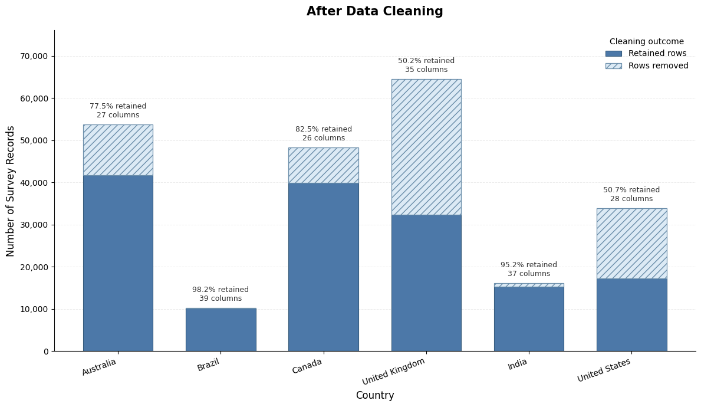
```

The recoding stage also produced one collapsed comorbidity variable, one relative 14-day survey-time variable, and explicit \(\texttt{N/A}\) levels for remaining categorical missing values. The original \(\texttt{i12\_health\_*}\) items were removed after the behaviour variables had been constructed.


## Policy-period construction

The regional policy audit produced 138 region-specific mandate start dates across the six retained countries. Every cleaned survey response was assigned to either the before-mandate or after-mandate period; no records remained with an unknown mandate-period value. Figure \ref{fig:results-policy-periods-figure} shows the resulting country-level distribution.

```{r results-policy-periods-figure, echo=FALSE, fig.cap="Result of before-mandate and after-mandate periods", out.width="100%", fig.pos="H"}
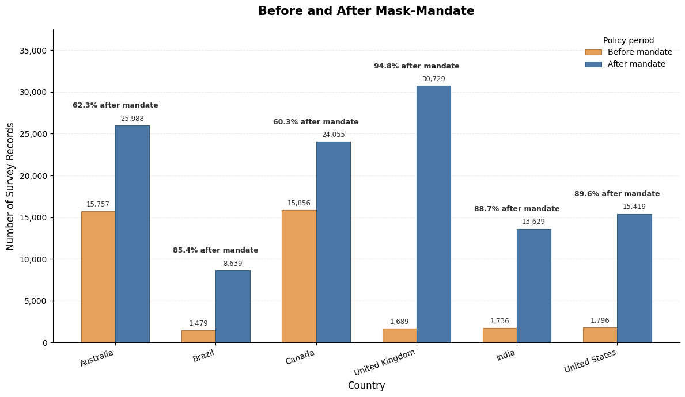
```

The after-mandate share was 60.3\% in Canada and 62.3\% in Australia. It exceeded 85\% in Brazil, India, the United Kingdom and the United States.


## Feature encoding and train-test split

The number of encoded columns differed across countries. After removing identifiers, dates, policy-period fields and outcome-related leakage variables, the face-mask task contained one additional predictor relative to the overall protective-behaviour task: the non-mask protective behaviour score. The resulting dimensions are shown in Table \ref{tab:results-feature-dimensions}.

\begin{table}[H]
\centering
\small
\begin{tabular}{lrrr}
\toprule
Country & Encoded columns & Face-mask predictors & Overall-behaviour predictors \\
\midrule
Australia & 67 & 59 & 58 \\
Brazil & 130 & 122 & 121 \\
Canada & 71 & 63 & 62 \\
United Kingdom & 81 & 73 & 72 \\
India & 127 & 119 & 118 \\
United States & 102 & 94 & 93 \\
\bottomrule
\end{tabular}
\caption{Result After encoding}
\label{tab:results-feature-dimensions}
\end{table}

All 4 modelling tasks were successfully constructed for each of the 6 countries by combining the two policy periods with the two prediction outcomes. This produced 24 country--period--outcome tasks and, because each task generated separate training and test files for the predictors and target, 96 split files in total. The planned 80/20 training--test allocation was applied consistently across all tasks using the common random seed specified in the Methods. Stratification was performed with respect to the binary target within each task, thereby preserving the observed outcome-class proportions as closely as possible between the training and test sets. The resulting feature matrices contained only numerical predictors, including binary dummy variables represented as 0 or 1, and all target vectors retained valid binary outcome classes. Consequently, a complete and internally consistent set of 24 modelling datasets was available for subsequent model fitting and evaluation.


## Model fitting and tuning

Random Forest and XGBoost were fitted to each of the 24 country--period--outcome tasks, resulting in 48 final model pipelines. The training data for every task contained sufficient observations in both outcome classes to support the planned stratified cross-validation procedure, so the full set of country, policy-period and outcome comparisons was retained for model evaluation. For each algorithm and task, 40 candidate hyperparameter configurations were sampled through randomised search. Across the 24 tasks, this corresponded to 960 sampled configurations for Random Forest and a further 960 for XGBoost. Hyperparameter selection was based on mean cross-validated ROC AUC within the training data, after which the selected pipeline for each task was refitted using the complete training set. The held-out test data were then used for the final comparison of predictive discrimination.

The resulting test ROC AUC values are reported in Table \ref{tab:results-test-auc}. For each country--period--outcome task, the larger of the two AUC values is shown in bold to indicate which model achieved the stronger held-out discrimination.


\begin{table}[H]
\centering
\footnotesize
\setlength{\tabcolsep}{3pt}
\renewcommand{\arraystretch}{1.18}
\begin{tabular}{p{0.085\linewidth}p{0.17\linewidth}cc@{\hspace{0.65cm}}p{0.085\linewidth}p{0.17\linewidth}cc}
\cmidrule(r){1-4}\cmidrule(l){5-8}
Country & Outcome & RF & XGBoost & Country & Outcome & RF & XGBoost \\
\cmidrule(r){1-4}\cmidrule(l){5-8}

Australia &
\shortstack[l]{Face mask wearing\\Before mandate} &
0.844 & \textbf{0.854} &
UK &
\shortstack[l]{Face mask wearing\\Before mandate} &
0.687 & \textbf{0.695} \\

&
\shortstack[l]{Face mask wearing\\After mandate} &
0.909 & \textbf{0.912} &
&
\shortstack[l]{Face mask wearing\\After mandate} &
0.715 & \textbf{0.724} \\

&
\shortstack[l]{Protective behaviour\\Before mandate} &
0.767 & \textbf{0.772} &
&
\shortstack[l]{Protective behaviour\\Before mandate} &
0.797 & \textbf{0.799} \\

&
\shortstack[l]{Protective behaviour\\After mandate} &
0.826 & \textbf{0.831} &
&
\shortstack[l]{Protective behaviour\\After mandate} &
0.829 & \textbf{0.838} \\

\addlinespace[0.45em]

Brazil &
\shortstack[l]{Face mask wearing\\Before mandate} &
0.783 & \textbf{0.785} &
India &
\shortstack[l]{Face mask wearing\\Before mandate} &
0.757 & \textbf{0.764} \\

&
\shortstack[l]{Face mask wearing\\After mandate} &
0.652 & \textbf{0.653} &
&
\shortstack[l]{Face mask wearing\\After mandate} &
\textbf{0.856} & 0.851 \\

&
\shortstack[l]{Protective behaviour\\Before mandate} &
\textbf{0.712} & 0.705 &
&
\shortstack[l]{Protective behaviour\\Before mandate} &
\textbf{0.823} & 0.801 \\

&
\shortstack[l]{Protective behaviour\\After mandate} &
\textbf{0.829} & 0.827 &
&
\shortstack[l]{Protective behaviour\\After mandate} &
0.827 & \textbf{0.831} \\

\addlinespace[0.45em]

Canada &
\shortstack[l]{Face mask wearing\\Before mandate} &
\textbf{0.842} & 0.840 &
US &
\shortstack[l]{Face mask wearing\\Before mandate} &
0.842 & \textbf{0.845} \\

&
\shortstack[l]{Face mask wearing\\After mandate} &
0.842 & \textbf{0.845} &
&
\shortstack[l]{Face mask wearing\\After mandate} &
0.856 & \textbf{0.860} \\

&
\shortstack[l]{Protective behaviour\\Before mandate} &
0.847 & \textbf{0.851} &
&
\shortstack[l]{Protective behaviour\\Before mandate} &
0.840 & \textbf{0.847} \\

&
\shortstack[l]{Protective behaviour\\After mandate} &
0.831 & \textbf{0.837} &
&
\shortstack[l]{Protective behaviour\\After mandate} &
0.850 & \textbf{0.858} \\

\cmidrule(r){1-4}\cmidrule(l){5-8}
\end{tabular}
\caption{Model comparison (AUC)}
\label{tab:results-test-auc}
\end{table}

XGBoost had the higher test AUC in 19 of the 24 tasks, while Random Forest had the higher value in five tasks. No task was tied. The mean test AUC was 0.809 for XGBoost and 0.807 for Random Forest. In most cases, the XGBoost model performs better and has a higher AUC value.


## XGBoost feature importance

XGBoost was used for the final feature-importance figures because it had the higher held-out test AUC in 19 of the 24 tasks. Each figure shows the ten features with the largest importance in either policy period after state indicators and explicit \(\texttt{N/A}\) categories were removed. The left and right bars correspond to the before-mandate and after-mandate models, respectively; the upper and lower panels show face-mask wearing and overall protective behaviour.
\newpage


### Australia

```{r feature-importance-australia, echo=FALSE, fig.cap="Feature importance (Australia)", out.width="88%", fig.pos="H"}
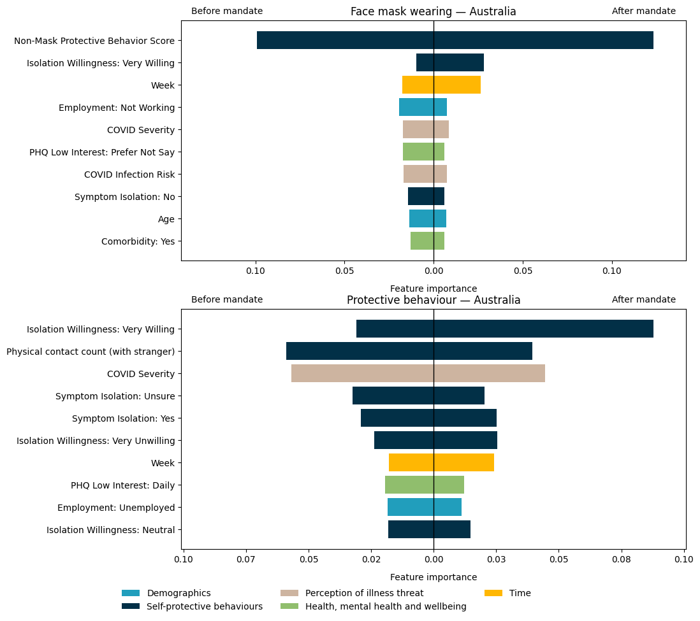
```


In Figure \ref{fig:feature-importance-australia}, Non-Mask Protective Behavior Score was the largest displayed feature for face-mask wearing in both policy periods, with substantially greater importance than the remaining displayed predictors. Isolation Willingness: Very Willing was also prominent, particularly after the mandate, while Week, employment status, COVID Severity and COVID Infection Risk appeared among the remaining leading features. For overall protective behaviour, the ranking differed more clearly between periods. Physical contact count (with stranger) had the largest displayed importance before the mandate, followed closely by COVID Severity, whereas Isolation Willingness: Very Willing became the dominant displayed feature after the mandate. Symptom-isolation responses, Week, PHQ Low Interest: Daily and employment status also appeared among the ten displayed features. 

\newpage


### Brazil

```{r feature-importance-brazil, echo=FALSE, fig.cap="Feature importance (Brazil)", out.width="88%", fig.pos="H"}
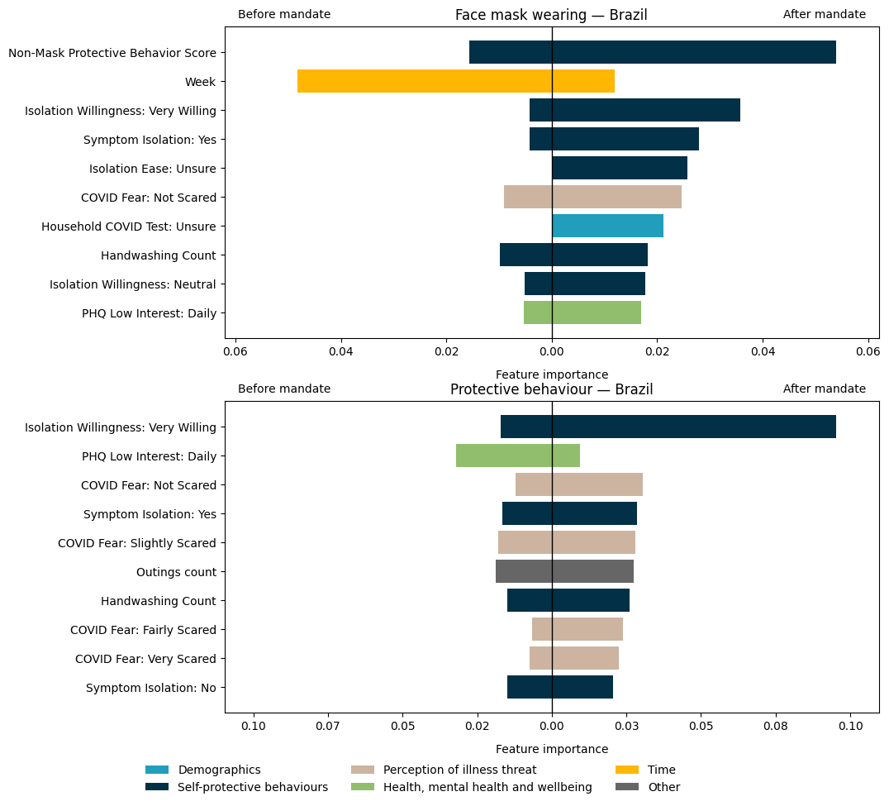
```

Figure \ref{fig:feature-importance-brazil} shows a marked difference in the leading displayed features for face-mask wearing across the two policy periods. Week had the largest importance before the mandate, whereas Non-Mask Protective Behavior Score was the largest displayed feature after the mandate. Symptom-isolation responses, household COVID-testing status, handwashing count and PHQ Low Interest: Daily also appeared among the leading features. For overall protective behaviour, PHQ Low Interest: Daily had the largest displayed importance before the mandate, while Isolation Willingness: Very Willing was clearly dominant after the mandate. Several COVID-fear categories were included among the ten displayed features, together with symptom-isolation responses, outings count and handwashing count. In contrast with countries where the same leading feature remained dominant across both periods, the Brazilian results showed greater changes in the ordering of the most important displayed predictors between the before- and after-mandate models.
\newpage


### Canada
```{r feature-importance-canada, echo=FALSE, fig.cap="Feature importance (Canada)", out.width="88%", fig.pos="H"}
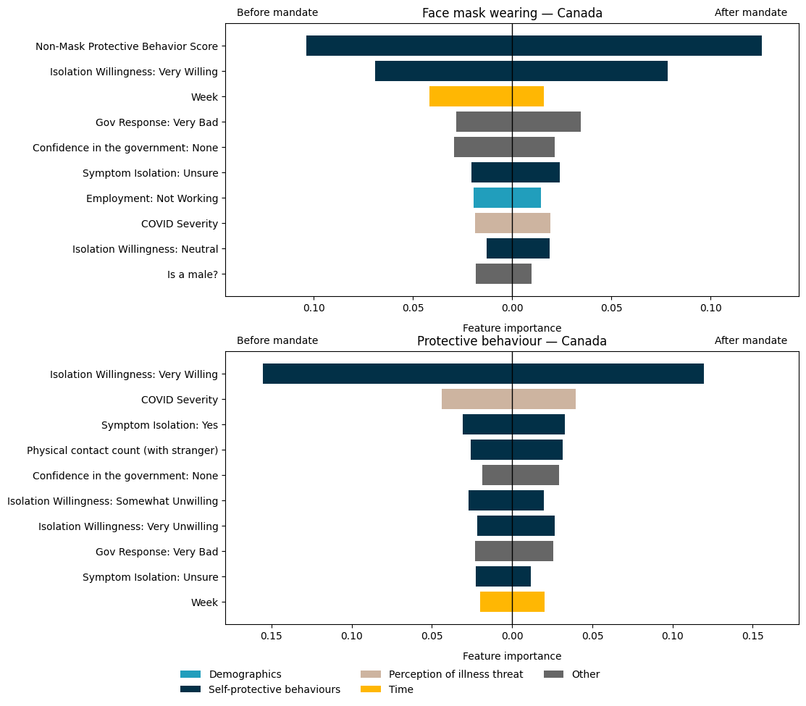
```

Figure \ref{fig:feature-importance-canada} shows Non-Mask Protective Behavior Score as the largest displayed feature for face-mask wearing in both periods, with Isolation Willingness: Very Willing ranked second in both models. Week was also prominent before the mandate, while confidence in government, perceived government response, employment status, COVID Severity and symptom-isolation responses appeared among the remaining leading features. For overall protective behaviour, Isolation Willingness: Very Willing was the largest displayed feature before and after the mandate and was separated noticeably from the remaining predictors. COVID Severity, physical contact count (with stranger), confidence in government and several isolation-willingness or symptom-isolation categories also appeared in the top ten.


\newpage


### India

```{r feature-importance-india, echo=FALSE, fig.cap="Feature importance (India)", out.width="88%", fig.pos="H"}
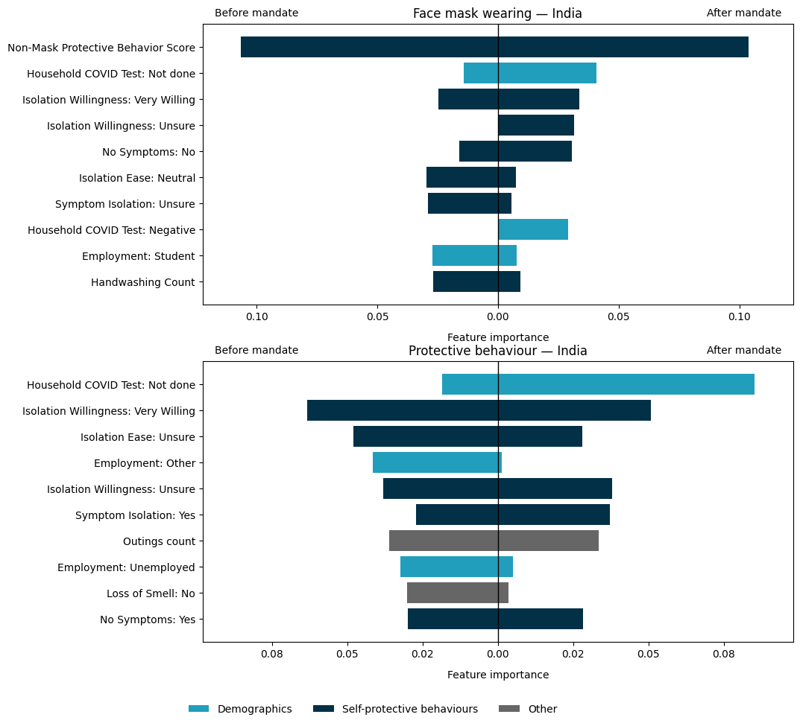
```

In Figure \ref{fig:feature-importance-india}, Non-Mask Protective Behavior Score was the largest displayed feature for face-mask wearing in both policy periods and was clearly separated from the other displayed predictors. Household COVID Test: Not done, isolation-willingness categories, symptom-isolation responses, employment status and handwashing count also appeared among the ten leading features. For overall protective behaviour, the highest-ranked feature changed across periods: Isolation Willingness: Very Willing had the largest displayed importance before the mandate, whereas Household COVID Test: Not done was the largest after the mandate. Employment categories, symptom-isolation responses, outings count and health-related variables were also represented among the leading features.

\newpage


### United Kingdom

```{r feature-importance-united-kingdom, echo=FALSE, fig.cap="Feature importance (United Kindom) ", out.width="88%", fig.pos="H"}
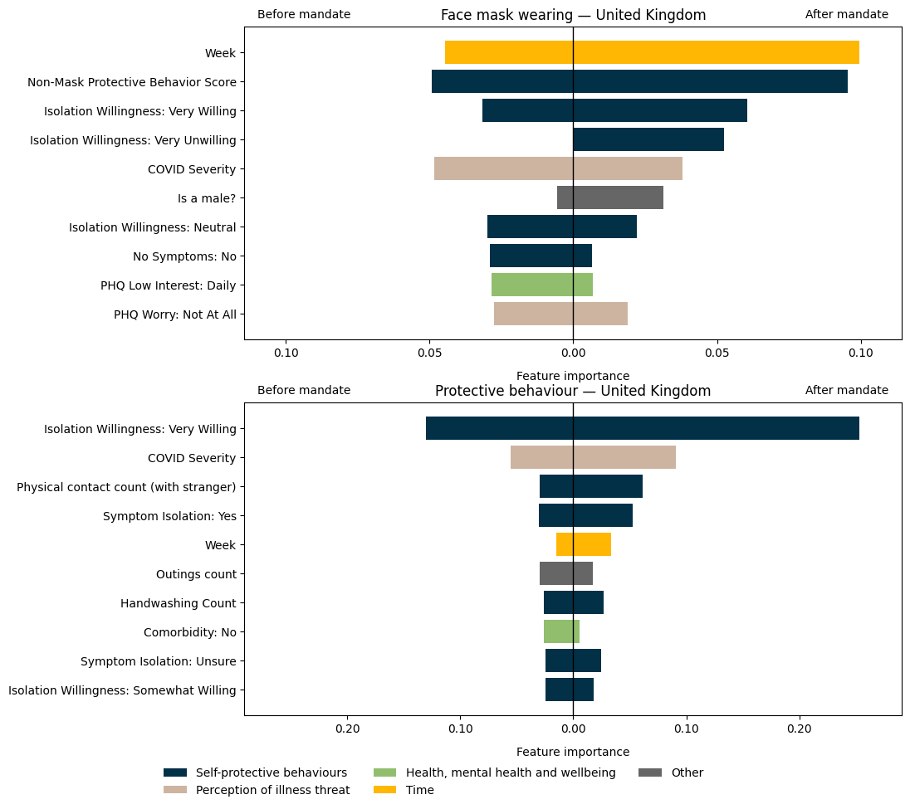
```

Figure \ref{fig:feature-importance-united-kingdom} shows a change in the leading displayed feature for face-mask wearing between the two policy periods. Non-Mask Protective Behavior Score had the largest importance before the mandate, whereas Week was the largest displayed feature after the mandate. Isolation Willingness: Very Willing was also prominent, together with COVID Severity, other isolation-willingness categories and selected mental-health variables. For overall protective behaviour, Isolation Willingness: Very Willing was the largest displayed feature in both periods and had substantially greater importance than the remaining displayed predictors. COVID Severity ranked second, while physical contact count (with stranger), symptom isolation, Week, outings count, handwashing count and comorbidity status also appeared among the top ten.

\newpage


### United States

```{r feature-importance-united-states, echo=FALSE, fig.cap="Feature importance (United States)", out.width="88%", fig.pos="H"}
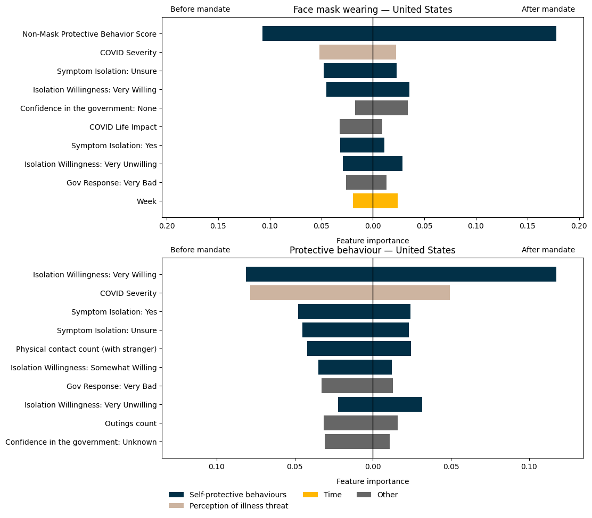
```

In Figure \ref{fig:feature-importance-united-states}, Non-Mask Protective Behavior Score was the largest displayed feature for face-mask wearing before and after the mandate, with a substantially higher importance than the remaining predictors in both periods. COVID Severity, symptom-isolation responses, Isolation Willingness: Very Willing, employment status, confidence in government, perceived government response and Week were also represented among the leading features. For overall protective behaviour, Isolation Willingness: Very Willing was the largest displayed feature in both periods, followed by COVID Severity. The remaining top features included symptom isolation, physical contact count (with stranger), additional isolation-willingness categories, outings count and confidence in government.

\newpage


# Discussion and Conclusion

## Discussion

The models achieved moderate to strong discrimination across most country, policy-period and outcome combinations, indicating that the survey variables contained meaningful predictive information about protective behaviour. XGBoost achieved the higher test ROC AUC in 19 of the 24 tasks, although its average advantage over Random Forest was small. The feature-importance results should therefore be interpreted as describing the predictive structure identified by a generally well-performing tree-based model rather than demonstrating a substantial superiority of one algorithm. Performance also varied across tasks: discrimination was strongest for face-mask wearing after mandate onset in Australia and weakest for the corresponding task in Brazil. Feature rankings from lower-performing models should consequently be interpreted with greater caution.

The predictor sets were not identical across countries because missingness screening and differences in survey content left each country with a shared core of variables and a set of additional country-specific predictors. The two outcomes and their construction were nevertheless consistent across all six countries. Cross-country comparisons should therefore focus on recurring predictor types and broader ranking patterns rather than assume that every model selected from exactly the same candidate variables. The absence of a feature from a country’s leading predictors may reflect limited predictive value, but it may also indicate that the variable was unavailable or represented differently in that country.

For face-mask wearing, the clearest recurring result was the importance of the Non-Mask Protective Behavior Score. It was the leading predictor in both policy periods in Australia, Canada, India and the United States, before the mandate in the United Kingdom, and after the mandate in Brazil. Respondents who frequently practised other preventive behaviours were therefore also more likely to report frequent mask wearing. Because the score excluded the mask item, this association was not produced by direct overlap with the outcome. Instead, it suggests that mask wearing formed part of a broader protective orientation rather than representing an isolated behaviour. Survey Week was the principal exception, becoming the leading mask-wearing predictor before the mandate in Brazil and after the mandate in the United Kingdom. Its importance indicates that mask behaviour changed over the course of the pandemic in ways not fully captured by the measured demographic and attitudinal predictors. Such temporal variation may reflect simultaneous changes in infection levels, public communication, social expectations and familiarity with mask use, although the present analysis cannot separate these processes.

For overall protective behaviour, Isolation Willingness: Very Willing was the most consistent leading predictor. It ranked first in both periods in Canada, the United Kingdom and the United States, after the mandate in Australia and Brazil, and before the mandate in India. Willingness to self-isolate may therefore represent a broader readiness to accept behavioural restrictions in response to infection risk. Perceived COVID-19 severity, symptom-related isolation, physical contact, outings and handwashing also appeared repeatedly, indicating that overall protective behaviour was associated with a combination of risk perception, willingness to restrict activity and existing behavioural practices.

Alongside these common patterns, the models identified clear national differences. Government confidence and evaluations of the government response were particularly visible in Canada and the United States. Household COVID-testing status and employment variables were more prominent in India, while mental-health measures, COVID-related fear, handwashing and survey timing appeared more strongly in Brazil. Physical contact was the leading overall-behaviour predictor before the mandate in Australia, whereas Week became the leading face-mask predictor after the mandate in the United Kingdom. These findings suggest that the common behavioural predictors operated within different social, institutional and epidemiological settings. This pattern is consistent with previous studies showing that protective behaviour is related to risk perception, trust, psychological factors and national context [@roma2020, pp. 2--6; @vanlissa2022, pp. 2--8; @taye2023, pp. 11--12]. The cross-national results also extend the earlier Australian evidence of differences before and after mandate onset [@ryan2025, pp. 2--4, 8--11], while showing that the form of these changes was not uniform across countries.

Predictor rankings changed between the pre- and post-mandate periods in every country, but the extent and structure of change were not uniform. Canada and the United States retained relatively stable leading predictors, and the dominant face-mask predictor also remained unchanged in Australia and India. More substantial changes occurred in other tasks. In Brazil, the leading face-mask predictor shifted from Week to the non-mask behaviour score, while the leading overall-behaviour predictor shifted from low interest to isolation willingness. In India, the leading overall-behaviour feature changed from isolation willingness to household COVID-testing status. In the United Kingdom, the leading face-mask feature changed from the non-mask behaviour score to Week. Australia also showed a change in the overall-behaviour model, from physical contact before the mandate to isolation willingness afterwards. Mandate onset was therefore associated with a reordering of predictive relationships, but not with a single transition shared equally by all countries.

These differences should not be interpreted as causal effects of mask mandates. The policy boundary separated observations into before- and after-mandate periods, but infection prevalence, public information, personal experience, social norms and the composition of survey responses also changed over time. Feature importance measures the contribution of a variable to prediction within a fitted model; it does not show that changing that variable would cause behaviour to change. The use of self-reported behaviour may also introduce recall or social-desirability bias, and the country-specific predictor sets limit direct comparison of exact importance values. The conclusions should therefore be understood as predictive associations rather than causal estimates.

## Conclusion

The findings provide connected answers to the three research questions. First, the important predictors changed between the pre- and post-mandate periods within every country, although some leading features remained stable while the importance of other variables was reorganised. Face-mask wearing was predicted most consistently by engagement in other protective behaviours, whereas overall protective behaviour was predicted most consistently by willingness to self-isolate. Second, the pattern of change was not consistent across countries. Some countries retained similar dominant predictors across the two periods, while others showed substantial shifts involving survey timing, testing status, employment, mental health or physical contact. Third, the results reveal both common cross-national predictors and country-specific influences. Broader protective orientation, isolation willingness and perceived severity recurred across several countries, but their relative importance and the contribution of additional factors changed according to national context and policy period. All countries therefore experienced changes in their predictive structure, but these changes combined shared tendencies with distinct country-level patterns rather than following one universal direction.


\newpage


# Acknowledgements

I would like to express my sincere gratitude to Anthony and Liangning for their guidance, feedback and support throughout this project. Their advice helped improve both the technical analysis and the presentation of the final report. I also acknowledge Imperial College London and YouGov for providing the COVID-19 Behaviour Tracker data, and the Oxford COVID-19 Government Response Tracker team for making the policy data publicly available.

I acknowledge the use of generative AI as a limited writing aid during the preparation of this report. AI were used primarily to improve sentence clarity, grammar and academic phrasing. All research decisions, data processing, model implementation, interpretation of results and final revisions were completed and verified by myself.

All the code and data for implementing these features can be found on my GitHub [@zhao2026github].


\newpage


# References

<div id="refs"></div>

\newpage


\appendix

# Mask-policy trajectories and mandate-date rule

\setcounter{figure}{0}
\renewcommand{\thefigure}{\thesection.\arabic{figure}}

##  Country-level mask mandate dates

```{r appendix-a-mask-policy-trajectory, echo=FALSE, fig.cap="Diagnostic mask-policy trajectories and mandate-date rule.", out.width="100%", fig.pos="H"}
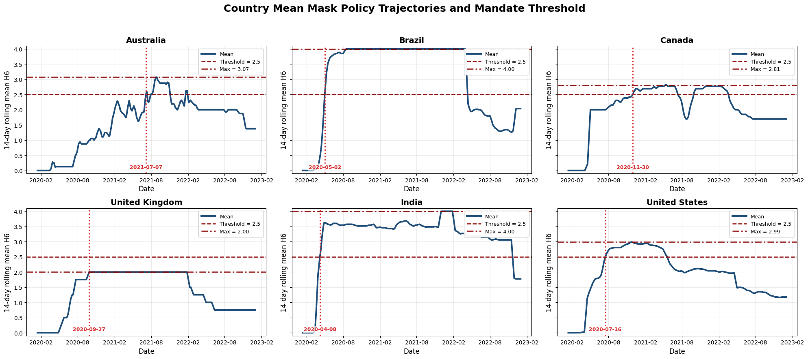
```

Figure \ref{fig:appendix-a-mask-policy-trajectory} shows the country-level mean of the 14-day rolling average of the OxCGRT \(\texttt{H6M\_Facial Coverings}\) indicator. The horizontal dashed line marks the threshold of 2.5, the dash-dotted line marks the maximum displayed value, and the vertical dotted line marks the selected mandate date.

The threshold was applied to the 14-day rolling average rather than to the raw daily value so that mandate onset was based on a sustained policy level rather than a short one-day change in the policy data. Where a region-level rolling average reached or exceeded 2.5, the first threshold-crossing date was used. Where a region did not reach this threshold, the first date on which the region reached its maximum 14-day rolling average was used instead. After a mandate start date was identified, survey responses dated before that point were assigned to the before-mandate period, while responses dated on or after that point were assigned to the after-mandate period.

The figure is a diagnostic check rather than the basis of the region-level assignments. Because it averages across regions, a country-level trajectory may not cross the threshold in the same way as every regional series.


## Regional mandate start dates

\setcounter{figure}{0}
\renewcommand{\thefigure}{\thesection.\arabic{subsection}.\arabic{figure}}

Figures \ref{fig:appendix-a-region-australia}--\ref{fig:appendix-a-region-united-states} show the region-specific mandate start dates used to assign the policy period in each of the six retained countries. Each point represents the selected mandate start date for one region, while the vertical dotted line shows the corresponding country-level date obtained from the rolling-mean rule described above.

### Australia

```{r appendix-a-region-australia, echo=FALSE, fig.cap="Australia mandate date", out.width="100%", fig.pos="H"}
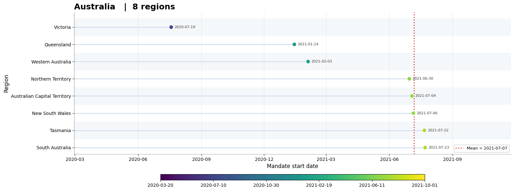
```


### Brazil

```{r appendix-a-region-brazil, echo=FALSE, fig.cap="Brazil mandate date", out.width="100%", fig.pos="H"}
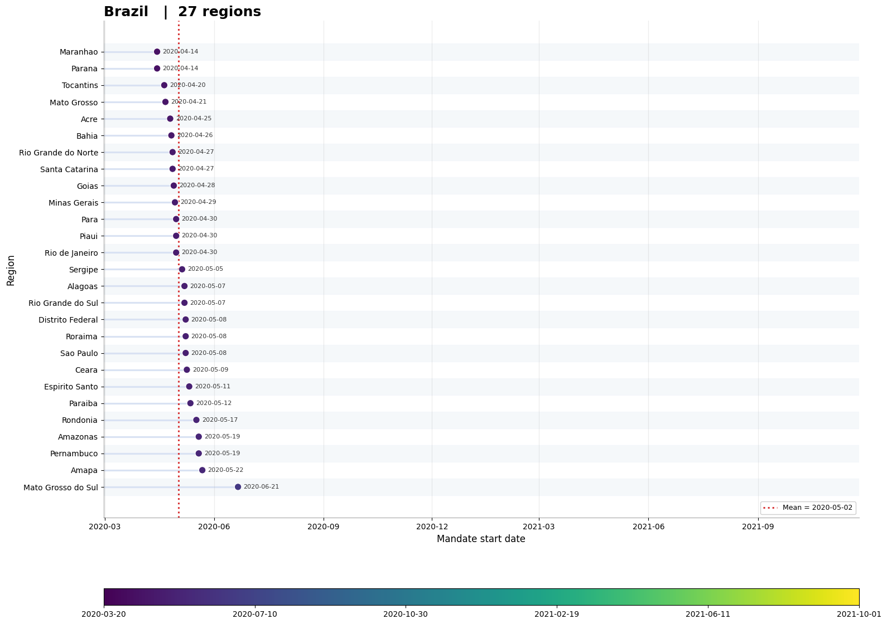
```


### Canada

```{r appendix-a-region-canada, echo=FALSE, fig.cap="Canada mandate date ", out.width="100%", fig.pos="H"}
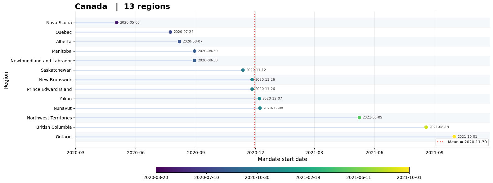
```


### United Kingdom

```{r appendix-a-region-united-kingdom, echo=FALSE, fig.cap="United Kingdom mandate date ", out.width="100%", fig.pos="H"}
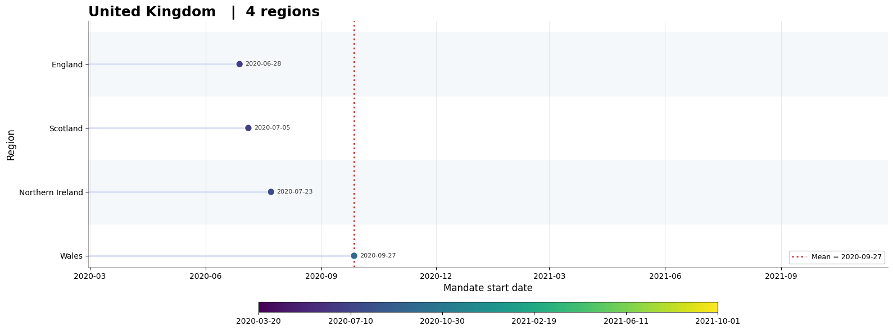
```


### India

```{r appendix-a-region-india, echo=FALSE, fig.cap="India mandate date", out.width="100%", fig.pos="H"}
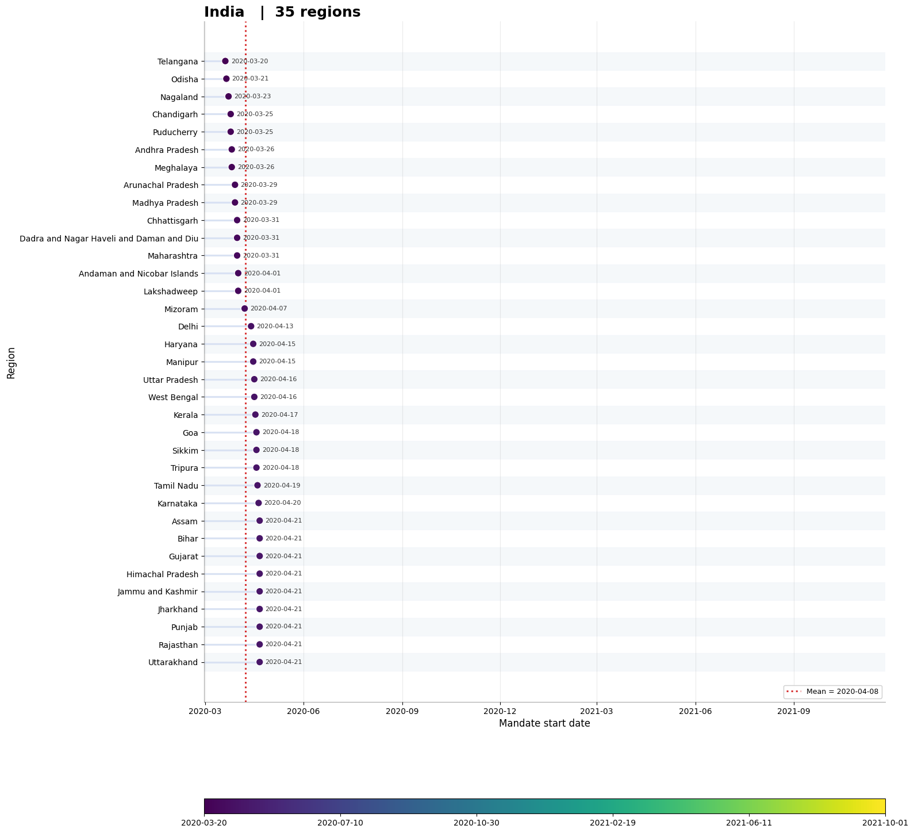
```


### United States

```{r appendix-a-region-united-states, echo=FALSE, fig.cap="United States mandate date", out.height="0.82\\textheight", fig.pos="H"}
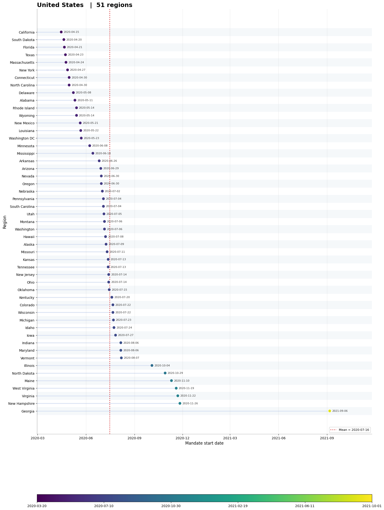
```
\newpage


# Code
Appendix B presents key excerpts and outputs from all source code files cited in the main text. The complete source code and supporting project files are available in the project GitHub repository [@zhao2026github].


\setcounter{figure}{0}
\renewcommand{\thefigure}{\thesection.\arabic{figure}}

## 001 Uniform column format.ipynb - Cell 3 - Reading csv

This code defines a helper function that reads a sample from each CSV file using the available encodings. It stores the imported data and creates a summary table containing the data source, country information, filename, detected encoding, and number of columns.

```python
# 2. Read all CSV 
def read_csv_sample(path):
    for encoding in ENCODINGS:
        try:
            df = pd.read_csv(path,encoding=encoding,nrows=SAMPLE_ROWS,na_values=
            [" ", "__NA__"],low_memory=False)
            return df, encoding
        except UnicodeDecodeError:
            continue
        except Exception:
            return None, encoding
    return None, None

rows = []
raw_data = {}

for source, country_code, path in DATA_FILES:
    df, encoding = read_csv_sample(path)
    raw_data[(source, country_code)] = df
    column_count = df.shape[1]
    rows.append({"source": source, "country_code": country_code,  
    "country_name": COUNTRY_NAMES[country_code], "filename": path.name,
    "encoding": encoding,"column_count": column_count})

encoding_check = pd.DataFrame(rows)
```

Figure \ref{fig:appendix-b1-output} summarises the encoding and column-count checks for the sampled CSV files. The results show that the United Kingdom CSV file uses \texttt{cp1252} encoding rather than \texttt{utf-8-sig}, so it requires separate handling during data import.

```{r appendix-b1-output, echo=FALSE, fig.cap="CSV file encoding and column-count check.", out.width="100%", fig.pos="H"}
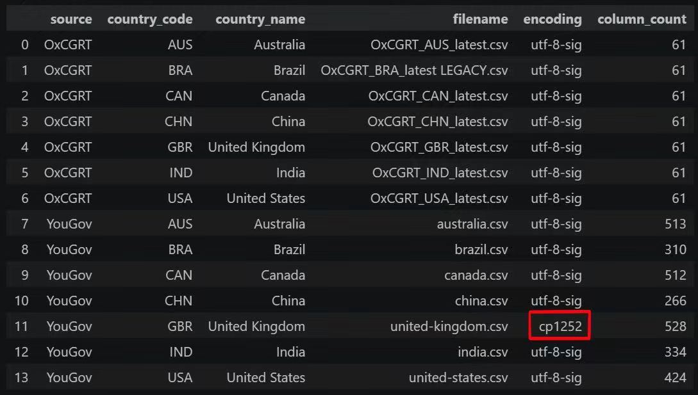
```


## 001 Uniform column format.ipynb - Cell 5,6 - Modify key columns

\setcounter{figure}{0}
\renewcommand{\thefigure}{\thesection.\arabic{subsection}.\arabic{figure}}

The following code checks whether every OxCGRT and YouGov file contains the columns required by the common preprocessing workflow. It records files that cannot be found and lists any required columns that are missing. 

```python
def check_missing_columns(data_dict, source, columns):
    rows = []
    for country in COUNTRY_NAMES:
        key = (source, country)
        if key not in data_dict:
            rows.append({"source": source,"country_code": country,
            "country_name": COUNTRY_NAMES[country],
            "column": None,"problem": "file not found"})
            continue
        df = data_dict[key]
        for col in columns:
            if col not in df.columns:
                rows.append({"source": source,"country_code": country,
                "country_name": COUNTRY_NAMES[country],
                "column": col,"problem": "missing column"})
    return pd.DataFrame(rows)

# Check if contain key columns
raw_missing = pd.concat([check_missing_columns(raw_data,
"OxCGRT", USED_OXCGRT_COLS),
check_missing_columns(raw_data, "YouGov", USED_YOUGOV_COLS),],ignore_index=True)

# Visualise
print("Errors:")
if raw_missing.empty:
    display(pd.DataFrame({"message": ["No missing columns"]}))
else:
    display(raw_missing)
```

Figure \ref{fig:appendix-b21-missing-columns} presents the resulting audit and shows that the China YouGov file does not contain several required variables, including columns needed for employment and policy-attitude predictors.


```{r appendix-b21-missing-columns, echo=FALSE, fig.cap="Wrong columns", out.width="100%", fig.pos="H"}
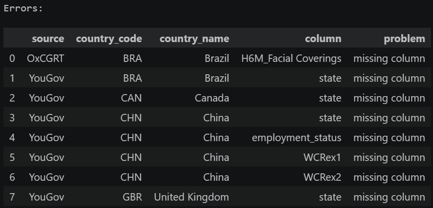
```


The next code block standardises the column names needed for the shared workflow. It renames \(\texttt{H6\_Facial Coverings}\) to \(\texttt{H6M\_Facial Coverings}\) in the Brazil OxCGRT file and renames \(\texttt{region}\) to \(\texttt{state}\) in the YouGov files for Brazil, Canada and the United Kingdom. China is then removed from the final country list because its missing columns prevent consistent preprocessing and modelling. 

```python
# Rename columns
RENAME_MAP = {
    ("OxCGRT", "BRA"): {"H6_Facial Coverings": "H6M_Facial Coverings"},
    ("YouGov", "BRA"): {"region": "state"},
    ("YouGov", "CAN"): {"region": "state"},
    ("YouGov", "GBR"): {"region": "state"}}

# Delete China
EXCLUDED_COUNTRIES = ["CHN"]
FINAL_COUNTRIES = [country for country in COUNTRY_NAMES if country not in EXCLUDED_COUNTRIES]
```
Figure \ref{fig:appendix-b22-renaming-exclusion} shows these renaming and exclusion settings.

```{r appendix-b22-renaming-exclusion, echo=FALSE, fig.cap="Correct the key columns", out.width="100%", fig.pos="H"}
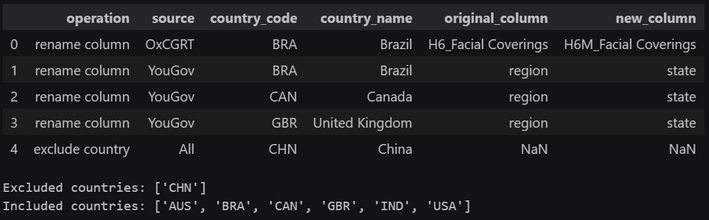
```


## 001_2 State mapping.ipynb - Cell 3,4,5 - Mapping regions

\setcounter{figure}{0}
\renewcommand{\thefigure}{\thesection.\arabic{subsection}.\arabic{figure}}

The following code compares the state or region names in the YouGov and OxCGRT files after normalising their text. It identifies names that appear in one dataset but do not have a corresponding match in the other dataset for each country.

```python
# Find differences  between YouGov  and  OxCGRT
def check_unmatched_states(yougov_df, oxcgrt_df):
    yougov = pd.DataFrame({"yougov_state": sorted(yougov_df["state"].dropna().unique())})
    oxcgrt = pd.DataFrame({"oxcgrt_region": sorted(oxcgrt_df["RegionName"].dropna().unique())})

    yougov["key"] = yougov["yougov_state"].map(norm_text)
    oxcgrt["key"] = oxcgrt["oxcgrt_region"].map(norm_text)

    yougov_only = (yougov.loc[~yougov["key"].isin(set(oxcgrt["key"])), 
    "yougov_state"].reset_index(drop=True).rename("yougov_state_without_oxcgrt_match"))
    oxcgrt_only = (oxcgrt.loc[~oxcgrt["key"].isin(set(yougov["key"])), 
    "oxcgrt_region"].reset_index(drop=True).rename("oxcgrt_region_without_yougov_match"))

    return pd.concat([yougov_only, oxcgrt_only], axis=1)

before_unmatched_tables = {}

for code, country_name in COUNTRIES.items():
    print("\n" + "=" * 100)
    print(f"{country_name}")
    print("=" * 100)

    yougov_path = UNIFORM_DIR / f"YouGov_{country_name}.csv"
    oxcgrt_path = UNIFORM_DIR / f"OxCGRT_{country_name}.csv"

    yougov_df = read_csv_clean(yougov_path)
    oxcgrt_df = read_csv_clean(oxcgrt_path)

    unmatched_table = check_unmatched_states(yougov_df, oxcgrt_df)
    before_unmatched_tables[code] = unmatched_table

    if unmatched_table.empty:
        print("Everything ok")
    else:
        print("Error:")
        display(unmatched_table)
```

Figures \ref{fig:appendix-b311-canada}--\ref{fig:appendix-b314-united-states} show the unmatched regional names identified for Canada, the United Kingdom, India and the United States before the state-mapping corrections were applied.

```{r appendix-b311-canada, echo=FALSE, fig.cap="Canada no mapped regions", out.width="100%", fig.pos="H"}
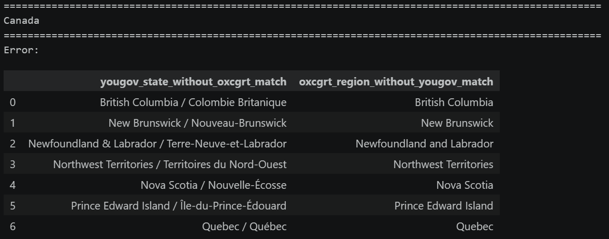
```

```{r appendix-b312-united-kingdom, echo=FALSE, fig.cap="United Kingdom no mapped regions", out.width="100%", fig.pos="H"}
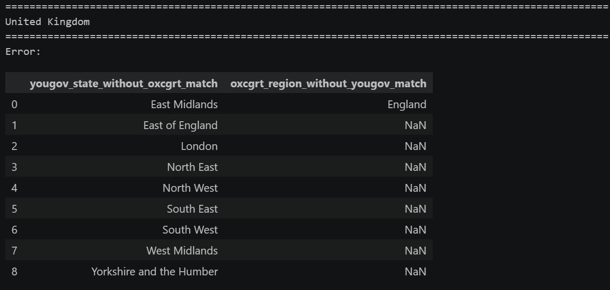
```

```{r appendix-b313-india, echo=FALSE, fig.cap="India no mapped regions", out.width="100%", fig.pos="H"}
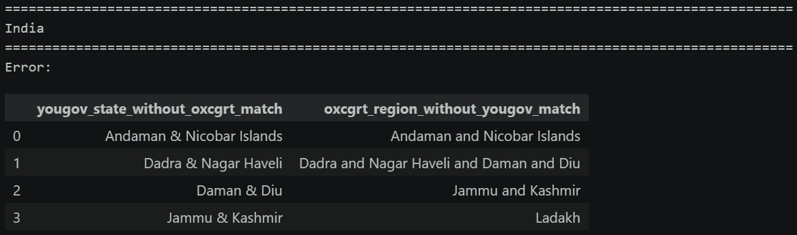
```

```{r appendix-b314-united-states, echo=FALSE, fig.cap="United States no mapped region", out.width="100%", fig.pos="H"}
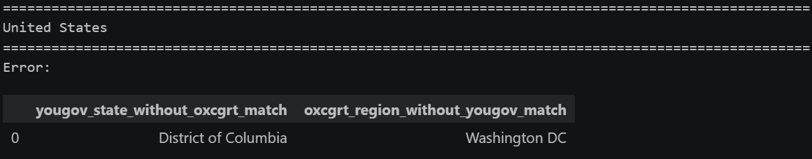
```

The following mapping corrects the unmatched regional names identified above for Canada, the United Kingdom, India and the United States. It standardises the relevant YouGov state names so that they correspond to the OxCGRT region names. The Indian region of Ladakh is removed because it cannot be mapped consistently between the two datasets.

```python
STATE_MAPPING = {

    # Correct some naming errors (Canada)
    "Canada": {
        "British Columbia / Colombie Britanique": "British Columbia",
        "British Columbia / Colombie Britannique": "British Columbia",
        "New Brunswick / Nouveau-Brunswick": "New Brunswick",
        "Newfoundland & Labrador / Terre-Neuve-et-Labrador": "Newfoundland and Labrador",
        "Northwest Territories / Territoires du Nord-Ouest": "Northwest Territories",
        "Nova Scotia / Nouvelle-Écosse": "Nova Scotia",
        "Prince Edward Island / Île-du-Prince-Édouard": "Prince Edward Island",
        "Quebec / Québec": "Quebec"},

    # Correct some naming errors (UK)
    "United Kingdom": {
        "East Midlands": "England",
        "East of England": "England",
        "London": "England",
        "North East": "England",
        "North West": "England",
        "South East": "England",
        "South West": "England",
        "West Midlands": "England",
        "Yorkshire and the Humber": "England"},

    # Correct some naming errors (India)
    "India": {
        "Andaman & Nicobar Islands": "Andaman and Nicobar Islands",
        "Dadra & Nagar Haveli": "Dadra and Nagar Haveli and Daman and Diu",
        "Daman & Diu": "Dadra and Nagar Haveli and Daman and Diu",
        "Jammu & Kashmir": "Jammu and Kashmir",},

    # Correct some naming errors (US)
    "United States": {"District of Columbia": "Washington DC"}}


# Delete regions that cannot be mapped (India)
DROP_OXCGRT_REGIONS = {"India": ["Ladakh"]}
```


## 002 Data Clean.ipynb - Cell 9 - Remove unusable columns and variables

The following code loads the YouGov and OxCGRT files for each retained country and stores copies of the data in separate dictionaries. It calculates the missing-value rate for every YouGov column, retains only columns with no more than 30% missing values, and removes \(\texttt{cantril\_ladder}\), \(\texttt{qweek}\), \(\texttt{weight}\) and \(\texttt{household\_children}\). The final list of retained variables for each country is saved in \(\texttt{retained\_columns\_by\_country}\) for subsequent modelling.

```python
# Create 3 dictionaries
raw_yougov_data = {}                        # Yougov data
raw_oxcgrt_data = {}                        # OxCGRT data
retained_columns_by_country = {}            # Variable names retained 

# Read
for code, country_name in COUNTRIES.items():

    yougov_path = UNIFORM_DIR / f"YouGov_{country_name}.csv"
    oxcgrt_path = UNIFORM_DIR / f"OxCGRT_{country_name}.csv"

    yougov_df = read_csv_clean(yougov_path)
    oxcgrt_df = read_csv_clean(oxcgrt_path)

    raw_yougov_data[code] = yougov_df.copy()
    raw_oxcgrt_data[code] = oxcgrt_df.copy()
    
    # FilterVariablesand
    missing_rate = yougov_df.isna().mean()     
    
    # Retain variables (attrition rate <= 30%)
    retained_cols = missing_rate[missing_rate <= 0.3].index.tolist()   
    
    # If the 4 columns are retained, 
    # this will result in a large number of missing values in the sample
    retained_cols = [col for col in retained_cols if col not in 
    ["cantril_ladder","qweek","weight","household_children"]] 
    
    # Save
    retained_columns_by_country[code] = retained_cols                                                                              
```


## 002 Data Clean.ipynb - Cell 5 - Recode

```python
# Recode risk perception
def recode_agreement_value(x):
    if pd.isna(x):
        return np.nan
    x = str(x).strip()
    agreement_map = {         # Some Formatting Issues
        "7 - Agree": 7,
        "7 – Agree": 7,
        "7 — Agree": 7,
        "7": 7,
        "6": 6,
        "5": 5,
        "4": 4,
        "3": 3,
        "2": 2,
        "1 - Disagree": 1,
        "1 – Disagree": 1,
        "1 — Disagree": 1,
        "1": 1}
    return agreement_map.get(x, np.nan)


# Recode frequency of protective behaviors
def recode_frequency_value(x):
    if pd.isna(x):
        return np.nan
    x = str(x).strip()
    
    frequency_map = {         # Definition scale
    "Always": 5, 
    "Frequently": 4,
    "Sometimes": 3,
    "Rarely": 2, 
    "Not at all": 1}     
  
    return frequency_map.get(x, np.nan)
```

This code converts the agreement-scale risk-perception responses into ordered scores from 1 to 7 and converts protective-behaviour frequency responses into ordered scores from 1 to 5. Missing values and unrecognised responses are returned as missing values.


## 002 Data Clean.ipynb - Cell 10 - Outcome definitions

\setcounter{figure}{0}

```python
# Common columns retained in all countries
common_columns = sorted
(set.intersection(*[set(cols) for cols in retained_columns_by_country.values()]))
# "i12_health_xxx" Common columns retained in all countries
common_i12_cols = sort_i12_columns
([col for col in common_columns if col.startswith("i12_health_")])


# Face mask outcome
FACE_MASK_OUTCOME_COLS = ["i12_health_1"]  
missing_face_mask_cols = 
[col for col in FACE_MASK_OUTCOME_COLS if col not in common_i12_cols]
if len(missing_face_mask_cols) > 0:
    raise ValueError("error")


# Cross-national outcome item sets
COMMON_I12_OUTCOME_COLS = common_i12_cols

# No mask protective behaviour
NON_MASK_PROTECTIVE_BEHAVIOUR_OUTCOME_COLS =
[col for col in COMMON_I12_OUTCOME_COLS if col not in FACE_MASK_OUTCOME_COLS]  

# Overall protective behaviour
OVERALL_PROTECTIVE_BEHAVIOUR_OUTCOME_COLS = ( COMMON_I12_OUTCOME_COLS.copy() )   


# Display
outcome_definition_table = pd.DataFrame({
    "outcome": 
    ["face_mask_behaviour_binary",
    "non_mask_protective_behaviour_binary",
    "overall_protective_behaviour_binary"],
    
    "columns_used": [", ".join(FACE_MASK_OUTCOME_COLS),
    ",".join(NON_MASK_PROTECTIVE_BEHAVIOUR_OUTCOME_COLS),
    ",".join(OVERALL_PROTECTIVE_BEHAVIOUR_OUTCOME_COLS)],
    "number_of_columns": [len(FACE_MASK_OUTCOME_COLS),
    len(NON_MASK_PROTECTIVE_BEHAVIOUR_OUTCOME_COLS),
    len(OVERALL_PROTECTIVE_BEHAVIOUR_OUTCOME_COLS)]})

display(outcome_definition_table)
```

The code identifies the protective-behaviour variables retained across all countries and defines the item sets used for the face-mask, non-mask protective-behaviour and overall protective-behaviour outcomes. Figure \ref{fig:appendix-b6-outcome-definitions} shows the resulting definition table. The two outcomes are "\(\texttt{Face Mask Wearing}\) " and "\(\texttt{Overall Protective Behaviour}\) ". "Non-Mask Protective Behaviour" is the independent variable for "Face Mask Wearing".


```{r appendix-b6-outcome-definitions, echo=FALSE, fig.cap="Outcome definitions and retained protective-behaviour items", out.width="100%", fig.pos="H"}
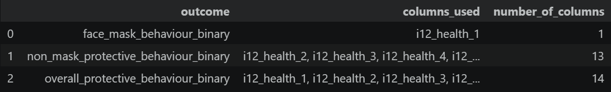
```


## 002 Data Clean.ipynb - Cell7

```python
# Convert behaviour scale to binary compliance outcome
# Protective behaviors frequency is (1~5) 
# (1 = Not at all   2 = Rarely   3 = Sometimes   4 = Frequently   5 = Always)
def binary_from_scale(series, threshold=4): 

    # if Frequency >= 4 → 1 ; if Frequency < 4 → 0
    return np.where(series.notna(),np.where(series >= threshold, 1, 0),np.nan)          


# Create face mask, non-mask and overall behaviour outcomes
def add_behaviour_outcomes(df):
    out = df.copy()  
    
    # Face mask behaviour scale
    out["face_mask_behaviour_scale"] = 
    out[FACE_MASK_OUTCOME_COLS].median(axis=1, skipna=False)  
    
    # Face mask behaviour binary
    out["face_mask_behaviour_binary"] = 
    binary_from_scale(out["face_mask_behaviour_scale"])    

    # No mask protective behaviour scale
    out["non_mask_protective_behaviour_scale"] = 
    out[NON_MASK_PROTECTIVE_BEHAVIOUR_OUTCOME_COLS].median(axis=1, skipna=False)  
    
    # No mask protective behaviour binary
    out["non_mask_protective_behaviour_binary"] = 
    binary_from_scale(out["non_mask_protective_behaviour_scale"])   

    # Overall protective behaviour scale
    out["overall_protective_behaviour_scale"] = 
    out[OVERALL_PROTECTIVE_BEHAVIOUR_OUTCOME_COLS].median(axis=1, skipna=False) 
    
    # Overall protective behaviour binary
    out["overall_protective_behaviour_binary"] = 
    binary_from_scale(out["overall_protective_behaviour_scale"])                   

    return out
```

The function first converts each protective-behaviour scale into a binary compliance outcome. Scores of 4 or 5, corresponding to “Frequently” or “Always”, are classified as compliant and coded as 1, while scores below 4 are coded as 0. Missing scale values remain missing rather than being assigned to either class.

The second function creates three respondent-level outcomes. The face-mask scale is calculated from the designated face-mask item, the non-mask protective-behaviour scale is the median of the retained protective-behaviour items excluding face-mask wearing, and the overall protective-behaviour scale is the median across all retained protective-behaviour items. Because `skipna=False` is used, each median is calculated only when all items required for that score are observed; otherwise, the resulting scale and binary outcome remain missing. The non-mask score can therefore be used as a predictor in the face-mask task, whereas it should not be included as a predictor in the overall protective-behaviour task because its component items also contribute to the overall outcome.


## 002 Data Clean.ipynb - Cells 4,8,11 - Data Clean

The following selected code excerpts show the key operations used to handle missing values, construct the comorbidity variable and create the relative survey-time variable without reproducing all supporting code from the three notebook cells.

```python
# Return columns treated as categorical variables
def get_categorical_columns(df):
    return df.select_dtypes(include=["object","category","bool","string"]).columns.tolist()


# Retain categorical missing values as an explicit category
def fill_categorical_missing_with_NA(df):
    out = df.copy()
    categorical_cols = get_categorical_columns(out)

    if len(categorical_cols) > 0:
        out[categorical_cols] = out[categorical_cols].fillna("N/A")
    return out


# Drop rows with missing values in numeric or datetime columns
def drop_rows_with_numeric_or_datetime_missing(df):
    out = df.copy()
    numeric_or_datetime_cols = out.select_dtypes
    (include=["number", "datetime64[ns]"]).columns.tolist()

    rows_before = out.shape[0]

    if len(numeric_or_datetime_cols) > 0:
        out = out.dropna(subset=numeric_or_datetime_cols).copy()

    rows_after = out.shape[0]
    rows_dropped = rows_before - rows_after

    return out, rows_dropped, numeric_or_datetime_cols


# Collapse the original d1_health_* variables into one comorbidity variable
def collapse_comorbidity_variables(df):
    out = df.copy()
    d1_cols = 
    [ col for col in out.columns if col.startswith("d1_health_") ]

    if len(d1_cols) == 0:
        return out

    out["d1_comorbidities"] = "N/A"

    disease_cols = 
    [col for col in d1_cols if col not in ["d1_health_98", "d1_health_99"]]

    if len(disease_cols) > 0:
        has_comorbidity = ( out[disease_cols].astype(str).eq("Yes").any(axis=1))
        out.loc[ has_comorbidity, "d1_comorbidities"] = "Yes"

    if "d1_health_99" in out.columns:
        out.loc[out["d1_health_99"].astype(str).eq("Yes"),"d1_comorbidities"] = "No"

    if "d1_health_98" in out.columns:
        out.loc[
            out["d1_health_98"].astype(str).eq("Yes"),
           "d1_comorbidities" ] = "Prefer_not_to_say"

    out = out.drop(columns=d1_cols)
    return out


# Create a relative survey-time variable using 14-day intervals
def add_week_number(df):
    out = df.copy()
    start_date = out["endtime"].min()
    out["week_number"] = 
    (((out["endtime"] - start_date).dt.days // 14) + 1)
    return out


# Selected processing sequence from the country-level cleaning loop
df = add_behaviour_outcomes(df)

df, rows_dropped_numeric_or_datetime, numeric_or_datetime_cols_checked = 
    (drop_rows_with_numeric_or_datetime_missing(df))

df = fill_categorical_missing_with_NA(df)
df = collapse_comorbidity_variables(df)
df = add_week_number(df)
```

After the behaviour outcomes are created, the code identifies all numeric and datetime variables and removes any row with a missing value in those columns. Missing values in categorical variables are not used to remove respondents; instead, they are replaced with the explicit category `N/A`, allowing these responses to remain in the dataset and later be dummy encoded.

The original disease-specific `d1_health_*` columns are then combined into a single categorical variable. A respondent is assigned `Yes` when at least one disease-specific item is marked `Yes`, while the original responses representing no comorbidity and unwillingness to disclose health information are retained as `No` and `Prefer_not_to_say`. Respondents without a recorded category remain `N/A`, and the original disease-specific columns are removed.

Finally, `week_number` expresses survey timing relative to the first retained response date within each country. The difference between each respondent's completion date and that starting date is divided into consecutive 14-day intervals, with the first interval coded as 1.


## 002 Data Clean.ipynb - Cells 3,6 - Policy Period


The following selected code excerpts show how the regional face-covering policy dates and the respondent-level policy-period variable were constructed without reproducing the unrelated helper and audit code from the notebook.


```python
# Settings used to identify sustained face-covering policy periods
ROLLING_DAYS = 14
MANDATE_THRESHOLD = 2.5


# Parse the survey completion date
def parse_endtime(x):
    return pd.to_datetime(x, dayfirst=True, errors="coerce")


# Compute the policy start date for each subnational region
def compute_mandate_dates(oxcgrt_df):
    df = oxcgrt_df.copy()

    # Convert YYYYMMDD policy dates and the face-covering indicator
    df["policy_date"] = pd.to_datetime(
        df["Date"].astype(str),
        format="%Y%m%d",
        errors="coerce")
    df["H6M_Facial Coverings"] = pd.to_numeric(
        df["H6M_Facial Coverings"],
        errors="coerce")

    df = df.dropna( subset=["policy_date", "H6M_Facial Coverings"]).copy()
    df = df.sort_values("policy_date")

    region_rows = []
    region_df = df[df["RegionName"].notna()].copy()

    for region_name, g in region_df.groupby("RegionName"):
        g = g.sort_values("policy_date").copy()

        # A value is calculated only when all 14 daily observations are present
        g["rolling_h6"] = (
            g["H6M_Facial Coverings"].rolling(ROLLING_DAYS,
            min_periods=ROLLING_DAYS).mean())

        valid_rolling = g[g["rolling_h6"].notna()].copy()

        if len(valid_rolling) == 0:
            continue

        hit = valid_rolling[valid_rolling["rolling_h6"] >= MANDATE_THRESHOLD]

        if len(hit) > 0:
            mandate_start_date = hit["policy_date"].iloc[0]
            mandate_rule = "threshold"
        else:
            max_idx = valid_rolling["rolling_h6"].idxmax()
            mandate_start_date = valid_rolling.loc[
                max_idx, "policy_date" ]
            mandate_rule = "max_rolling"

        region_rows.append({
            "state": region_name,
            "mandate_start_date": mandate_start_date,
            "mandate_rule": mandate_rule})

    region_mandates = pd.DataFrame(
        region_rows,
        columns=["state", "mandate_start_date", "mandate_rule"])
    return region_mandates


# Add the respondent-level policy-period indicator
def add_mandate_period(yougov_df, region_mandates):
    out = yougov_df.copy()
    out["endtime"] = parse_endtime(out["endtime"])

    out = out.merge(region_mandates, on="state", how="left")

    out["within_mandate_period"] = np.nan
    valid = (out["endtime"].notna() & out["mandate_start_date"].notna())

    out.loc[valid, "within_mandate_period"] = (
        out.loc[valid, "endtime"]
        >= out.loc[valid, "mandate_start_date"]).astype(int)

    out = out.drop(
        columns=["mandate_start_date", "mandate_rule"],
        errors="ignore")
    return out
```

The code first converts the OxCGRT policy date from `YYYYMMDD` format to a calendar date and converts `H6M_Facial Coverings` to a numeric variable. It then processes each subnational region separately and calculates a 14-day rolling mean. The use of `min_periods=ROLLING_DAYS` means that a rolling value is retained only when all 14 daily observations are available.


For each region, the first date on which the rolling mean reaches the policy threshold is selected as the policy start date. If the threshold is never reached, the date with the maximum valid rolling mean is used. These regional dates are then merged with the YouGov data. Respondents surveyed on or after their region's policy start date are coded as 1 for `within_mandate_period`, and respondents surveyed before that date are coded as 0. Cases without a valid survey date or matched regional policy date remain missing.


## 002 Data Clean.ipynb - Cells 6 - Threshold

This code determines the start date of the face-covering policy for each subnational region. It first converts the OxCGRT date and face-covering indicator into appropriate date and numeric formats, removes invalid observations, and orders the records chronologically. A 14-day rolling mean of the \(\texttt{H6M\_Facial Coverings}\) indicator is then calculated separately for each region, with a value produced only when all 14 daily observations are available.


```python

# Compute mandate date
def compute_mandate_dates(oxcgrt_df):

    df = oxcgrt_df.copy()                                             # Copy
    
    df["policy_date"] = pd.to_datetime
    ( df["Date"].astype(str), format="%Y%m%d", errors="coerce")       # Convert date
    
    df["H6M_Facial Coverings"] = 
    pd.to_numeric( df["H6M_Facial Coverings"],errors="coerce")        # Convert H6M_Facial Coverings
    
    df = df.dropna(subset=["policy_date", "H6M_Facial Coverings"]).copy()     
    df = df.sort_values("policy_date")                                # Sort


    # 1 Region mandate dates
    region_rows = []
    region_df = df[df["RegionName"].notna()].copy()

    for region_name, g in region_df.groupby("RegionName"):
        g = g.sort_values("policy_date").copy()
        
        # 14-day rolling average to identify “ongoing” mask policy phases
        g["rolling_h6"] = (g["H6M_Facial Coverings"]
        .rolling(ROLLING_DAYS, min_periods=ROLLING_DAYS).mean())  
        
        # Keep valid rolling average values
        valid_rolling = g[g["rolling_h6"].notna()].copy()    

        if len(valid_rolling) == 0:
            continue
            
        # 14-day threshold
        hit = valid_rolling[valid_rolling["rolling_h6"] >= MANDATE_THRESHOLD]             

        # First date reaching the threshold
        if len(hit) > 0:
            mandate_start_date = hit["policy_date"].iloc[0]                                                      
            mandate_rule = "threshold"
        else:
            # First date reaching the maximum rolling average
            max_idx = valid_rolling["rolling_h6"].idxmax()                                                       
            mandate_start_date = valid_rolling.loc[max_idx, "policy_date"]
            mandate_rule = "max_rolling"

        region_rows.append({"state": region_name,
        "mandate_start_date": mandate_start_date,
        "mandate_rule": mandate_rule})

    region_mandates = pd.DataFrame(region_rows,
    columns=["state", "mandate_start_date", "mandate_rule"])
    
    return region_mandates
```


The mandate start date is defined as the first date on which the 14-day rolling mean reaches the specified policy threshold. When a region never reaches this threshold, the date with the highest observed 14-day rolling mean is used instead. The resulting table records each region, its estimated mandate start date, and whether the date was identified using the threshold rule or the maximum rolling-mean fallback rule.


## 002 Data Clean.ipynb - Cells 6 - Mandate Period


```python


# Add the mandate period (0/1)
def add_mandate_period(yougov_df,region_mandates):

    # Copy
    out = yougov_df.copy()        
    
    # Analyze the survey completion date
    out["endtime"] = parse_endtime(out["endtime"])   
    
    # Merge
    out = out.merge(region_mandates,on="state",how="left")                                                                          

    out["within_mandate_period"] = np.nan
    valid = out["endtime"].notna() & out["mandate_start_date"].notna()
    
    # Categories
    out.loc[valid, "within_mandate_period"] = 
    (out.loc[valid, "endtime"] >= out.loc[valid, "mandate_start_date"]).astype(int)     
    
     # Delete unnecessary columns
    out = out.drop(columns=["mandate_start_date", "mandate_rule"],errors="ignore")       
    return out


```
This code creates the binary `within_mandate_period` variable for each respondent. It converts the survey completion date into a valid date format, merges the region-specific mandate start date into the YouGov data using `state`, and compares the two dates. Respondents surveyed on or after the mandate start date are coded as 1, while those surveyed before it are coded as 0. Cases with a missing survey date or mandate start date remain missing, and the temporary mandate-related columns are removed after the variable is created.


## 002 Data Clean.ipynb - Cells 5,11 and 003 Column Names update.ipynb - Cells 3,4 - Feature Encoding

The following code shows the key steps used to convert categorical predictors into numerical dummy variables while keeping the binary outcome columns unchanged. It also illustrates how the encoded column names were converted into labels that were easier to interpret in the modelling results.

```python
# Keep binary outcomes as target variables
TARGET_COLUMNS = [
    "face_mask_behaviour_binary",
    "overall_protective_behaviour_binary"]

# Identify categorical predictors only
categorical_cols = [
    col for col in df.select_dtypes(
        include=["object", "category", "bool"]).columns
    if col not in TARGET_COLUMNS]

# One-hot encode categories and use the first category as the reference
encoded_df = pd.get_dummies(
    df,
    columns=categorical_cols,
    drop_first=True,
    dtype=int)

# Convert selected dummy-variable prefixes into readable labels
READABLE_PREFIXES = {
    "state_": "State: ",
    "employment_": "Employment: ",
    "isolation_willingness_": "Isolation Willingness: "}

def readable_column_name(column):
    for prefix, label in READABLE_PREFIXES.items():
        if column.startswith(prefix):
            category = column[len(prefix):].replace("_", " ")
            return f"{label}{category}"
    return column.replace("_", " ")

encoded_df = encoded_df.rename(columns=readable_column_name)
```

The code identifies categorical predictors, excludes the binary outcomes from encoding, and applies one-hot encoding with `drop_first=True`. Consequently, one category from each categorical variable is retained as the reference category, while the remaining categories are represented by 0/1 dummy columns. The final renaming step replaces technical dummy-variable names with clearer labels such as `State: New South Wales`, `Employment: Retired` and `Isolation Willingness: Very Willing`.


## 004 Split.ipynb - Cells 5,6 - Modelling Tasks

The following selected code illustrates how each country's data was divided into four modelling tasks by combining two policy periods with two binary outcomes.

```python
PERIODS = {
    0: "before_mandate",
    1: "after_mandate"}

OUTCOMES = {
    "face_mask": "face_mask_behaviour_binary",
    "overall_protective_behaviour":
        "overall_protective_behaviour_binary"}

tasks = {}

for country_code, country_df in encoded_data.items():
    for period_value, period_name in PERIODS.items():
        period_df = country_df.loc[
            country_df["within_mandate_period"] == period_value
        ].copy()

        for outcome_name, target_col in OUTCOMES.items():
            y = period_df[target_col].astype(int)

            # EXCLUDED_COLUMNS is defined separately for each outcome
            X = period_df.drop(
                columns=EXCLUDED_COLUMNS[outcome_name],
                errors="ignore").copy()

            # Convert Boolean dummy columns to numerical 0/1 values
            bool_cols = X.select_dtypes(include=["bool"]).columns
            X[bool_cols] = X[bool_cols].astype(int)

            # Confirm that every predictor supplied to the model is numeric
            non_numeric = [
                col for col in X.columns
                if not pd.api.types.is_numeric_dtype(X[col])]

            if non_numeric:
                raise TypeError(
                    f"Non-numeric predictors found: {non_numeric}")

            task_name = (
                f"{country_code}_{period_name}_{outcome_name}")
            tasks[task_name] = {"X": X, "y": y}
```

For each retained country, the code first separates responses into before-mandate and after-mandate subsets. Each period is then paired with the face-mask outcome and the overall protective-behaviour outcome, producing four tasks per country. Boolean dummy variables are converted to integers, and the final check prevents a task from being saved when any non-numeric predictor remains.


## 004 Split.ipynb - Cells 3,6 - Feature Exclusion

The following code shows the outcome-specific feature-exclusion rules used before modelling. These rules remove organisational variables and outcome-derived variables while retaining the non-mask protective behaviour score only for the face-mask task.

```python
ORGANISATIONAL_COLUMNS = [
    "respondent_id",
    "endtime",
    "within_mandate_period"]

BINARY_OUTCOME_COLUMNS = [
    "face_mask_behaviour_binary",
    "non_mask_protective_behaviour_binary",
    "overall_protective_behaviour_binary"]

BEHAVIOUR_SCALE_COLUMNS = [
    "face_mask_behaviour_scale",
    "non_mask_protective_behaviour_scale",
    "overall_protective_behaviour_scale"]

def excluded_columns_for_task(outcome_name):
    excluded = set(
        ORGANISATIONAL_COLUMNS
        + BINARY_OUTCOME_COLUMNS
        + BEHAVIOUR_SCALE_COLUMNS)

    if outcome_name == "face_mask":
        # This score excludes the mask item and can be used as a predictor
        excluded.remove(
            "non_mask_protective_behaviour_scale")

    elif outcome_name != "overall_protective_behaviour":
        raise ValueError(f"Unknown outcome: {outcome_name}")

    return sorted(excluded)


EXCLUDED_COLUMNS = {
    "face_mask":
        excluded_columns_for_task("face_mask"),
    "overall_protective_behaviour":
        excluded_columns_for_task(
            "overall_protective_behaviour")}
```

Respondent identifiers, survey dates and the mandate-period indicator are removed because they organise the data rather than represent substantive predictors. All binary outcome columns and behaviour scales are also excluded to prevent the model from receiving information derived directly from an outcome. The only exception is `non_mask_protective_behaviour_scale` in the face-mask task, because this score is calculated without the face-mask item. It is excluded from the overall protective-behaviour task because its component items also contribute to that outcome.


## 004 Split.ipynb - Cells 3,5,6 - Train-Test Split

The following code shows the common 80/20 splitting rule applied to every country-period-outcome task and the condition used to determine whether stratification was possible.

```python
from sklearn.model_selection import train_test_split

TEST_SIZE = 0.20
RANDOM_SEED = 1948883

def split_task(X, y):
    class_counts = y.value_counts(dropna=False)

    # Stratify only when both binary classes have at least two cases
    use_stratification = (
        len(class_counts) == 2
        and class_counts.min() >= 2)

    stratify_target = y if use_stratification else None

    return train_test_split(
        X,
        y,
        test_size=TEST_SIZE,
        random_state=RANDOM_SEED,
        stratify=stratify_target)


for task_name, task_data in tasks.items():
    X_train, X_test, y_train, y_test = split_task(
        task_data["X"],
        task_data["y"])

    X_train.to_csv(
        SPLIT_DIR / f"{task_name}_X_train.csv",
        index=False)
    X_test.to_csv(
        SPLIT_DIR / f"{task_name}_X_test.csv",
        index=False)
    y_train.to_csv(
        SPLIT_DIR / f"{task_name}_y_train.csv",
        index=False)
    y_test.to_csv(
        SPLIT_DIR / f"{task_name}_y_test.csv",
        index=False)
```

Each task is divided into 80% training data and 20% test data using the fixed random seed `1948883`. Stratification is used only when both outcome classes contain at least two observations, which helps preserve the class distribution in the two subsets. Four files are produced for every task: `X_train`, `X_test`, `y_train` and `y_test`. Model fitting and hyperparameter tuning use only the training files, while the held-out test files remain reserved for final evaluation.


## 005 Random Forest (Model).ipynb and 006 XGBoost (Model).ipynb - Cells 4 - RandomOverSampler

The Random Forest pipeline first applies `RandomOverSampler` to balance the class distribution in the training data and then fits a Random Forest classifier. The classifier consists of 250 decision trees, with a fixed random seed for reproducibility and parallel processing enabled to improve computational efficiency.


```python
# Random Forest Pipeline
def build_pipeline():
    return Pipeline(steps=[("ros",
    RandomOverSampler(random_state=RANDOM_STATE)),
    
    # Processing class imbalance
    ("model",
    RandomForestClassifier
    ( n_estimators=250,
    random_state=RANDOM_STATE,
    n_jobs=-1,))])          # Train model

```

The XGBoost pipeline similarly applies `RandomOverSampler` before fitting the classification model, thereby reducing the influence of class imbalance during training. The model uses 250 boosting iterations with a binary logistic objective, log-loss evaluation metric, and the histogram-based tree-building method for efficient computation.


```python
# XGBoost Pipeline
def Build_pipeline():

    # Processing class imbalance
    return Pipeline(steps=[("ros", RandomOverSampler(random_state=RANDOM_STATE)),                                                 
                            ("model", XGBClassifier(n_estimators=250,
                            objective="binary:logistic",
                            eval_metric="logloss",
                            random_state=RANDOM_STATE,
                            n_jobs=-1,
                            tree_method="hist",))])          # Train model


```


## 005 Random Forest (Model).ipynb and 006 XGBoost (Model).ipynb - Cells 3,4,5 - Hyperparameter Tuning

The following code shows the common hyperparameter-tuning procedure used for both classifiers. The number of stratified cross-validation folds was determined from the minority-class count in each training set.

```python
from sklearn.model_selection import StratifiedKFold, RandomizedSearchCV

RANDOM_STATE = 1948883
N_SPLITS = 5
N_ITER_SEARCH = 40

def build_search(y_train, pipeline, parameter_grid):
    min_class_count = y_train.value_counts().min()

    # A stratified split requires at least two cases in each class
    if min_class_count < 2:
        raise ValueError("Not enough minority-class observations")

    # Use at most five folds and reduce the number when necessary
    n_splits = min(N_SPLITS, int(min_class_count))
    cv = StratifiedKFold(
        n_splits=n_splits,
        shuffle=True,
        random_state=RANDOM_STATE)

    return RandomizedSearchCV(
        estimator=pipeline,
        param_distributions=parameter_grid,
        n_iter=N_ITER_SEARCH,
        scoring="roc_auc",
        cv=cv,
        random_state=RANDOM_STATE,
        refit=True,
        n_jobs=1)


search = build_search(
    y_train=y_train,
    pipeline=build_pipeline(),
    parameter_grid=Param_distributions())

search.fit(X_train, y_train)
best_model = search.best_estimator_
```

For every country-period-outcome task, the procedure randomly evaluates 40 hyperparameter combinations using mean cross-validated ROC AUC. Shuffled stratified folds preserve the class distribution, while reducing the number of folds prevents a fold from containing no minority-class observations. Tasks with fewer than two minority-class training cases are skipped. Because `refit=True`, the selected pipeline is fitted again using the complete training set after tuning.


## 005 Random Forest (Model).ipynb - Cell 4 - Random Forest Classifier

The selected code below shows the Random Forest pipeline and the hyperparameters included in the random search.

```python
from sklearn.ensemble import RandomForestClassifier
from imblearn.over_sampling import RandomOverSampler
from imblearn.pipeline import Pipeline

def build_pipeline():
    return Pipeline(steps=[
        ("ros", RandomOverSampler(
            random_state=RANDOM_STATE)),
        ("model", RandomForestClassifier(
            n_estimators=250,
            random_state=RANDOM_STATE,
            n_jobs=-1))
    ])


def Param_distributions():
    return {
        "model__max_depth":
            [5, 8, 10, 12, 15, 20, None],
        "model__min_samples_split":
            [2, 5, 10, 20, 30],
        "model__min_samples_leaf":
            [1, 2, 5, 10],
        "model__max_features":
            ["sqrt", "log2", 0.3, 0.5, 0.7, None],
        "model__bootstrap":
            [True]
    }
```

The classifier uses 250 trees, the fixed random seed `1948883` and all available processor cores. Random oversampling is applied within the pipeline so that it is performed separately inside each training fold. The search varies tree depth, the minimum numbers of observations required to split a node or form a leaf, and the number of predictors considered at each split.


## 006 XGBoost (Model).ipynb - Cell 4 - XGBoost Classifier

The selected code below shows the XGBoost pipeline and the hyperparameters included in the random search.

```python
from xgboost import XGBClassifier
from imblearn.over_sampling import RandomOverSampler
from imblearn.pipeline import Pipeline

def Build_pipeline():
    return Pipeline(steps=[
        ("ros", RandomOverSampler(
            random_state=RANDOM_STATE)),
        ("model", XGBClassifier(
            n_estimators=250,
            objective="binary:logistic",
            eval_metric="logloss",
            tree_method="hist",
            random_state=RANDOM_STATE,
            n_jobs=-1))
    ])


def Param_distributions():
    return {
        "model__max_depth":
            [3, 4, 5, 6, 8, 10],
        "model__learning_rate":
            [0.01, 0.03, 0.05, 0.1, 0.2],
        "model__subsample":
            [0.6, 0.7, 0.8, 0.9, 1.0],
        "model__colsample_bytree":
            [0.5, 0.6, 0.7, 0.8, 0.9, 1.0],
        "model__min_child_weight":
            [1, 3, 5, 7],
        "model__gamma":
            [0, 0.01, 0.1, 0.3, 0.5, 1.0],
        "model__reg_alpha":
            [0, 0.01, 0.1, 1.0],
        "model__reg_lambda":
            [0.5, 1.0, 2.0, 5.0]
    }
```

The classifier uses 250 boosting trees with a binary logistic objective, log-loss evaluation and histogram-based tree construction. The random search tunes tree complexity, learning rate, row and column sampling, minimum child weight, split penalty and L1 and L2 regularisation. As in the Random Forest pipeline, oversampling is conducted within each training fold rather than before cross-validation.


## 005 Random Forest.ipynb and 006 XGBoost.ipynb - Cell 4 - Test ROC AUC

Cross-validated ROC AUC is used only for hyperparameter selection on the training data. Final performance is calculated once on the untouched test set using the predicted probability of the positive class. If the test target contains only one class, ROC AUC is stored as missing because it cannot be calculated.

```python
from sklearn.metrics import roc_auc_score

def evaluate_tuned_model(search, X_test, y_test):
    best_pipeline = search.best_estimator_
    best_cv_auc = search.best_score_

    positive_probability = (
        best_pipeline.predict_proba(X_test)[:, 1]
    )

    if y_test.nunique() < 2:
        test_auc = np.nan
    else:
        test_auc = roc_auc_score(
            y_test,
            positive_probability
        )

    return {
        "best_cv_auc": best_cv_auc,
        "test_auc": test_auc,
        "best_parameters": search.best_params_
    }
```


## 005 Random Forest.ipynb and 006 XGBoost.ipynb - Cell4,5,7 - Feature importance

Feature importance is extracted from the fitted model step of the final refitted pipeline and exported as a complete table for every task. For comparison plots, before- and after-mandate tables are merged by feature, state dummy variables and explicit `N/A` indicators are excluded, and the ten variables with the largest importance in either period are retained. Each displayed variable is then assigned to a broad interpretation category.

```python
def extract_feature_importance(
    fitted_pipeline,
    feature_names,
    output_path):
    fitted_model = fitted_pipeline.named_steps["model"]

    importance_table = pd.DataFrame({
        "feature": feature_names,
        "importance": fitted_model.feature_importances_
    }).sort_values(
        "importance",
        ascending=False)

    importance_table.to_csv(output_path, index=False)
    return importance_table


def prepare_before_after_plot(
    before_table,
    after_table,
    top_n=10):
    comparison = before_table.merge(
        after_table,
        on="feature",
        how="outer",
        suffixes=("_before", "_after")).fillna(0)

    keep = (
        ~comparison["feature"].str.startswith("State:", na=False)
        & ~comparison["feature"].str.contains(
            r"(^|: )N/A$",
            regex=True,
            na=False))
            
    comparison = comparison.loc[keep].copy()
    comparison["max_importance"] = comparison[
        ["importance_before", "importance_after"]].max(axis=1)

    return comparison.nlargest(
        top_n,
        "max_importance")


def feature_category(feature):
    text = feature.lower()

    if any(term in text for term in [
        "age", "gender", "employment",
        "education", "household"]):
        return "Demographics"

    if any(term in text for term in [
        "mask", "isolation", "handwash",
        "contact", "outings", "protective"]):
        return "Self-protective behaviours"

    if any(term in text for term in [
        "severity", "risk", "fear", "threat"]):
        return "Perception of illness threat"

    if any(term in text for term in [
        "health", "mental", "wellbeing",
        "comorbidity" ]):
        return "Health/mental-health/wellbeing"

    if "week" in text or "time" in text:
        return "Time"

    return "Other"


plot_table = prepare_before_after_plot(
    before_importance, after_importance)
    
plot_table["category"] = (
    plot_table["feature"].map(feature_category))
```


# Project structure

This appendix describes the computational project structure, software environment and execution order required to reproduce the data preparation, modelling and report outputs. All Python notebooks construct file paths from `Path.cwd()`. Consequently, Jupyter must be started from the project root directory, and the notebooks should remain in that directory when they are executed.

## Computational environment

The metadata stored in the supplied notebooks identifies the computational kernel as `Python 3` and records Python version `3.13.14`. The analysis was implemented as Jupyter notebooks. 

The statistical analysis is executed in Python rather than inside the R Markdown document. The final report is assembled separately using R Markdown. Rendering the report requires R, the `rmarkdown` and `knitr` packages, Pandoc, and a LaTeX distribution containing the `booktabs` and `float` packages.

## Project directory structure

The required project layout is shown below. Raw data must be placed in the two folders under `Data` using the exact filenames expected by `001 Uniform column format.ipynb`. All folders under `Cleaned Data` and `Result` are generated by the notebooks.

```text
Project root/
|-- Data/
|   |-- YouGov_Data/
|   |   |-- australia.csv
|   |   |-- brazil.csv
|   |   |-- canada.csv
|   |   |-- china.csv
|   |   |-- india.csv
|   |   |-- united-kingdom.csv
|   |   `-- united-states.csv
|   |   
|   |-- codebook.xlsx
|   |   
|   `-- OxCGRT_Data/
|       |-- OxCGRT_AUS_latest.csv
|       |-- OxCGRT_BRA_latest LEGACY.csv
|       |-- OxCGRT_CAN_latest.csv
|       |-- OxCGRT_CHN_latest.csv
|       |-- OxCGRT_GBR_latest.csv
|       |-- OxCGRT_IND_latest.csv
|       `-- OxCGRT_USA_latest.csv
|
|-- Cleaned Data/
|   |-- Uniform column format/
|   |   |-- YouGov_Australia.csv
|   |   |-- OxCGRT_Australia.csv
|   |   `-- corresponding YouGov and OxCGRT files for the other retained countries
|   |-- 002 Data Clean/
|   |   |-- cleaned_unencoded/
|   |   |-- cleaned_encoded/
|   |   `-- region_mandate_dates.csv
|   |-- 003 Column Names update/
|   |   |-- Columns update.csv
|   |   `-- <Country> (readable).csv
|   `-- 004 Split/
|       |-- Australia/
|       |-- Brazil/
|       |-- Canada/
|       |-- India/
|       |-- United_Kingdom/
|       `-- United_States/
|
|-- Result/
|   |-- Random Forest/
|   |   |-- random_forest_auc_results.csv
|   |   |-- random_forest_feature_importance_all.csv
|   |   `-- Figures/
|   `-- XGBoost/
|       |-- xgboost_auc_results.csv
|       |-- xgboost_feature_importance_all.csv
|       `-- Figures/
|
|-- 001 Uniform column format.ipynb
|-- 001_2 State mapping.ipynb
|-- 002 Data Clean.ipynb
|-- 003 Column Names update.ipynb
|-- 004 Split.ipynb
|-- 005 Random Forest (Model).ipynb
|-- 006 XGBoost (Model).ipynb
|-- 111 Dataset After Cleaning.ipynb
|-- 111 Why Mandate Thousold = 2.5.ipynb
`-- 111 AUC.ipynb
```

Within each country folder under `Cleaned Data/004 Split`, four modelling tasks are stored: face-mask wearing and overall protective behaviour, each before and after the mandate. Every task contains four files with the prefixes `X_train_`, `X_test_`, `y_train_` and `y_test_`.

## Execution order

The notebooks should be run using **Restart Kernel and Run All** in the following order.

\begin{table}[H]
\centering
\small
\begin{tabular}{p{0.06\linewidth}p{0.35\linewidth}p{0.49\linewidth}}
\toprule
Step & Notebook & Function and main output \\
\midrule
1 & \texttt{001 Uniform column format.ipynb} &
Audits the 14 raw CSV files, detects usable encodings, standardises required column names, excludes China from the common workflow and writes the retained YouGov and OxCGRT files to \texttt{Cleaned Data/Uniform column format}. \\
2 & \texttt{001\_2 State mapping.ipynb} &
Harmonises YouGov state names with OxCGRT region names. The corrected CSV files overwrite the corresponding files in \texttt{Cleaned Data/Uniform column format}. \\
3 & \texttt{002 Data Clean.ipynb} &
Recodes variables, screens missingness, constructs the behavioural outcomes, assigns region-specific mandate periods, creates encoded and unencoded cleaned datasets, and writes \texttt{region\_mandate\_dates.csv}. \\
4 & \texttt{003 Column Names update.ipynb} &
Converts encoded column names into readable labels and writes one readable modelling dataset for each retained country. \\
5 & \texttt{004 Split.ipynb} &
Creates the four country-period-outcome tasks for each country and saves the 80/20 train--test files using random seed \texttt{1948883}. \\
6 & \texttt{005 Random Forest (Model).ipynb} &
Tunes and evaluates the Random Forest models, saves the AUC and complete feature-importance tables, and exports the Random Forest feature-importance figures. \\
7 & \texttt{006 XGBoost (Model).ipynb} &
Tunes and evaluates the XGBoost models, saves the AUC and complete feature-importance tables, and exports the XGBoost feature-importance figures. \\
\bottomrule
\end{tabular}
\caption{Required notebook execution order.}
\label{tab:appendix-c-run-order}
\end{table}

The three notebooks whose filenames begin with `111` are supplementary output and diagnostic notebooks rather than inputs to the main modelling pipeline:

- `111 Dataset After Cleaning.ipynb` can be run after `002 Data Clean.ipynb` to summarise row retention and the before/after-mandate sample sizes.
- `111 Why Mandate Thousold = 2.5.ipynb` can be run after the uniform policy files and `region_mandate_dates.csv` have been created to display the national policy trajectories and regional mandate dates.
- `111 AUC.ipynb` must be run after both model notebooks because it reads the Random Forest and XGBoost AUC result files.

These supplementary notebooks display plots and tables in Jupyter but do not contain commands that automatically save all displayed outputs. Figures required by the report must therefore be exported and placed in the project root using the filenames referenced by `PartB_Report.Rmd`.

## Running the complete workflow

A complete reproduction can be carried out as follows:

1. Create the directory structure shown below and place all raw YouGov and OxCGRT CSV files in their required folders:


```text
Project root/
|-- Data/
|   |-- YouGov_Data/
|   |   |-- australia.csv
|   |   |-- brazil.csv
|   |   |-- canada.csv
|   |   |-- china.csv
|   |   |-- india.csv
|   |   |-- united-kingdom.csv
|   |   `-- united-states.csv
|   |   
|   |-- codebook.xlsx
|   |   
|   `-- OxCGRT_Data/
|       |-- OxCGRT_AUS_latest.csv
|       |-- OxCGRT_BRA_latest LEGACY.csv
|       |-- OxCGRT_CAN_latest.csv
|       |-- OxCGRT_CHN_latest.csv
|       |-- OxCGRT_GBR_latest.csv
|       |-- OxCGRT_IND_latest.csv
|       `-- OxCGRT_USA_latest.csv
|
|-- 001 Uniform column format.ipynb
|-- 001_2 State mapping.ipynb
|-- 002 Data Clean.ipynb
|-- 003 Column Names update.ipynb
|-- 004 Split.ipynb
|-- 005 Random Forest (Model).ipynb
|-- 006 XGBoost (Model).ipynb
|-- 111 Dataset After Cleaning.ipynb
|-- 111 Why Mandate Thousold = 2.5.ipynb
`-- 111 AUC.ipynb

```
2. Start Jupyter from the project root so that `Path.cwd()` resolves to that directory.
3. Run notebooks `001`, `001_2`, `002`, `003` , `004`, `005`, `006`in sequence.
(`005`, `006` The calculation of these two files takes a relatively long time, approximately 30 to 40 minutes.)
4. Run the relevant `111` notebooks to reproduce the diagnostic tables and plots used in the report.


Intermediate and final CSV files are written using `utf-8-sig` encoding. Existing generated files may be overwritten when the notebooks are run again. For a clean reproduction, the generated `Cleaned Data` and `Result` folders can be archived or removed before rerunning the workflow, while the raw files under `Data` should be preserved unchanged.


# Variable codebook

Definitions for all variables that may appear in the survey data and analysis can be found in `codebook.xlsx`, which is included in the project GitHub repository [@zhao2026github]. The workbook provides a reference for querying the meaning of the original variables used throughout the project.


